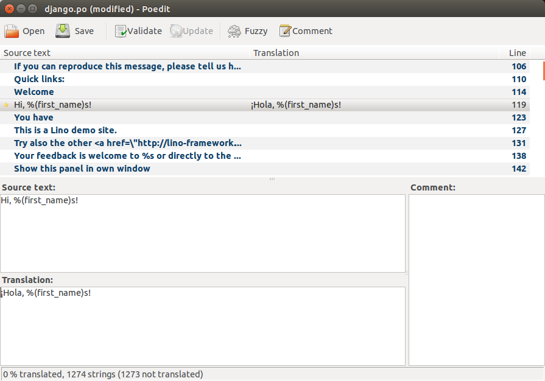
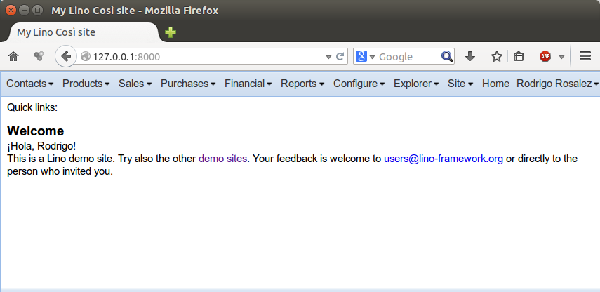

============================
Instructions for translators
============================

..
  >>> from lino.api.shell import *
  >>> print(settings.SITE.languages)
  (LanguageInfo(django_code=u'en', name='en', index=0, suffix=''), LanguageInfo(django_code=u'es', name='es', index=1, suffix='_es'))

Here is how your can help translating Lino into your own language.

Overview
--------

You are going to edit a series of :xfile:`.po` files which are part of
the code repositories of Lino.

To edit these :xfile:`.po` files you will be using either your
preferred plain text editor or a tool like Poedit_.  We recommend the
latter. On Debian you install it with ``apt-get install poedit``.

.. _Poedit: http://www.poedit.net

Set up a site
-------------

Before starting to translate, you must set up a site (a Django
project) on which you can see your work while you are evolving. You
cannot simply translate all those messages and then believe that they
are correct.

- We suppose that you have installed the :ref:`development version
  <lino.dev.install>` of Lino.  

- We suppose that :mod:`lino.projects.min1` is the application you
  want to translate.

- And let's say for example that you want to translate them to
  *Spanish*.

Go to your local project directory::

  $ cd ~/mysite

Change your project's :xfile:`settings.py` file once more so that it
looks as follows:

.. literalinclude:: settings.py

That is, you specify your own language distribution, consisting of
English as first language and Spanish (your language) as second. See
:attr:`lino.core.site.Site.languages` for details.  Note that the first language
cannot currently be Spanish because the demo fixtures would fail
(:srcref:`docs/tickets/108`).

If your language is not yet covered for Lino, then you must `Create a
demo user for your language`_ before going on.

Initialize the demo database::

  $ python manage.py initdb_demo

Run your rdevelopment server
----------------------------

Run the development server on the demo database::

  $ python manage.py runserver

Point your browser to view the application. Log in as the Spanish user.

.. image:: translate_1.png
  :scale: 80

Find the translatable strings
-----------------------------

The translatable strings on this page (`gettext` and Poedit_ call them
"messages") are for exampe the menu labels ("Contacts", "Producs"
etc), but also content texts like "Welcome", "Hi, Rodrigo!" or "This
is a Lino demo site."

Now you must locate these strings in the :file:`.po` file.

Open another terminal window and go to the Lino repository. 

  $ cd ~/repositories/lino

Translate
---------

Launch Poedit_, specifying the :file:`.po` file for the Spanish
translation (international language code for Spanish is ``es``)::

  $ poedit lino/locale/es/LC_MESSAGES/django.po

It looks similar to this screenshot:

Translate one or a few messages. In our example we translated the
following message::

  Hi, %(first_name)s!

into::

  ¡Hola, %(first_name)s!

Save your work in Poedit_.

Now you should first `touch` your `settings.py` file in order to tell
the development server process that something has changed. Open a
third terminal window and type::

  $ cd ~/mysite
  $ touch settings.py

This will cause the server process (which is running in the first
terminal window) to reload and to rewrite any cache files.

Refresh your browser page:

Submit your work
---------------------

When you are satisfied with your work, you will make a pull request to
ask us to integrate your changes into the public Lino repositories.

More about pull requests in :doc:`/dev/git`.

Create a demo user for your language
------------------------------------

If Lino does not yet have a default demo administrator for your
language (:mod:`lino.modlib.users.fixtures.demo`), then you need to
create a local fixture which adds a demo user for your language.  It's
easy::

  $ mkdir fixtures
  $ touch fixtures/__init__.py
  $ nano fixtures/demo.py

The :file:`demo.py` file should look as folloas:

.. literalinclude:: fixtures/demo.py

Trucs et astuces
----------------

Voici un pitfall: la traduction du string suivant::

  msgid "%(person)s has been unregistered from %(course)s"
  
ne doit pas être::

  msgstr "%(personne)s a été désinscrit du %(cours)"

mais bien::

  msgstr "%(person)s a été désinscrit du %(course)s"

C.-à-d. les mots-clés entre parenthèses sont des variables, 
et il *ne faut pas* les modifier.

À noter également que le ``s`` derrière la parenthèse ne sera pas 
imprimé mais est obligatoire 
(il indique à Python qu'il s'agit d'un remplacement de type `string`).
