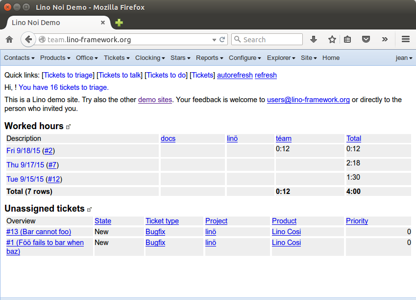
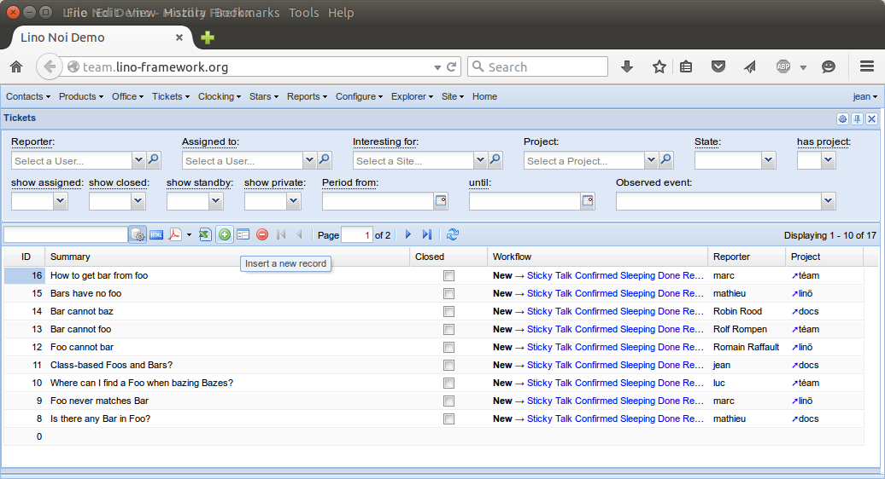
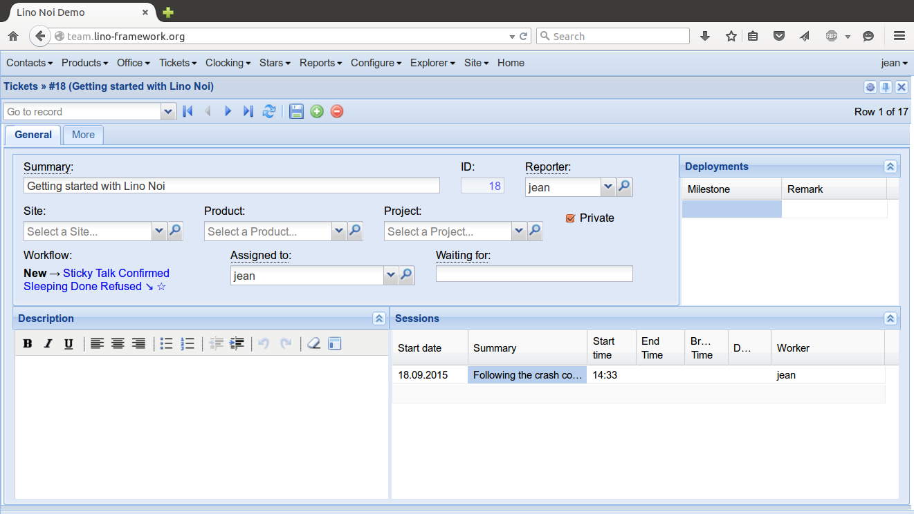

.. _noi.guide:

=====================
Lino Noi User's Guide
=====================

A little crash course.

Logging in
==========

- Point your browser to http://team.lino-framework.org/ and log in as
  user *jean*.  

  For this course we are using the public demo database. This database
  contains fictive data and is visible and writable for everybody. So
  please don't post any private information there.

Opening a new ticket
====================

- Open the list of all tickets using the quicklink "[Tickets]" or the
  menu :menuselection:`Tickets--> Tickets`

- Click the :guilabel:`Insert` button to create a new ticket:

  - Reporter: (you)
  - Summary: "Getting started with Lino Noi"

  Click the :guilabel:`Create` button or press :kbd:`ENTER` to confirm
  the insert window.

When you create a ticket, Lino automatically also creates a new
session on that ticket which starts at current time.  (If it doesn't,
then go to your user preferences and check the :guilabel:`Open session
on new ticket` checkbox).

Your session is visible as a row in the lower right table
"Sessions". You should write at least a few words in the "Summary" of
your session (by pressing :kbd:`F2` on that field). Type for example
"Following the crash course."

Now you are supposed to work on that ticket. When you stopped working,
click the :guilabel:`↘` link in the :guilabel:`Workflow` field of the
ticket. Lino will fill the :guilabel:`End time` field of your session
with the current time.

You can manually change the start and end times by pressing :kbd:`F2`
on these fields.

Now klick on the :guilabel:`↗` in the :guilabel:`Workflow` field of
the ticket. This will create a second session which starts at current
time.  Note that the :guilabel:`↗` in the :guilabel:`Workflow` field
has changed to a :guilabel:`↘`. That's because the ticket has a
started session with an empty :guilabel:`End time`.

Note another little oddness: you can manually clear the "End time"
field of your session, but Lino does not automatically change the
:guilabel:`↘` into a :guilabel:`↗`.  For the moment you must manually
click :guilabel:`Refresh` button of your ticket to refresh.

The main page
=============

Whatever you tried and played in our previous section, make now sure
that you have a session started (i.e. one which has no end time).
Then close the detail ticket window and the window with the list of
tickets and return to the main page.

Note the new sentence there:

  **You are busy with** #18 (Getting started with Lino Noi) (↘).

This is how a typical week might look for you. You can click on any
date (in first column) to see and possibly edit all sessions of that
day. When you hover the mouse over a ticket number, it shows the
ticket's summary.

Using this system, you always have an overview of your real hours
worked.

More
====

Read :doc:`/specs/index` to learn more about Lino Noi.

