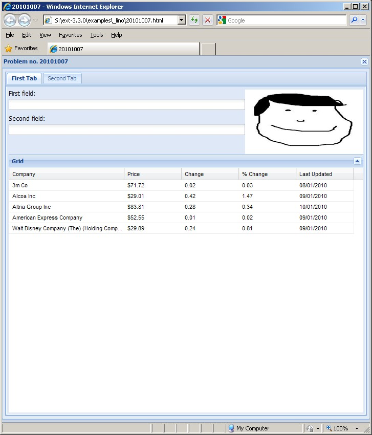
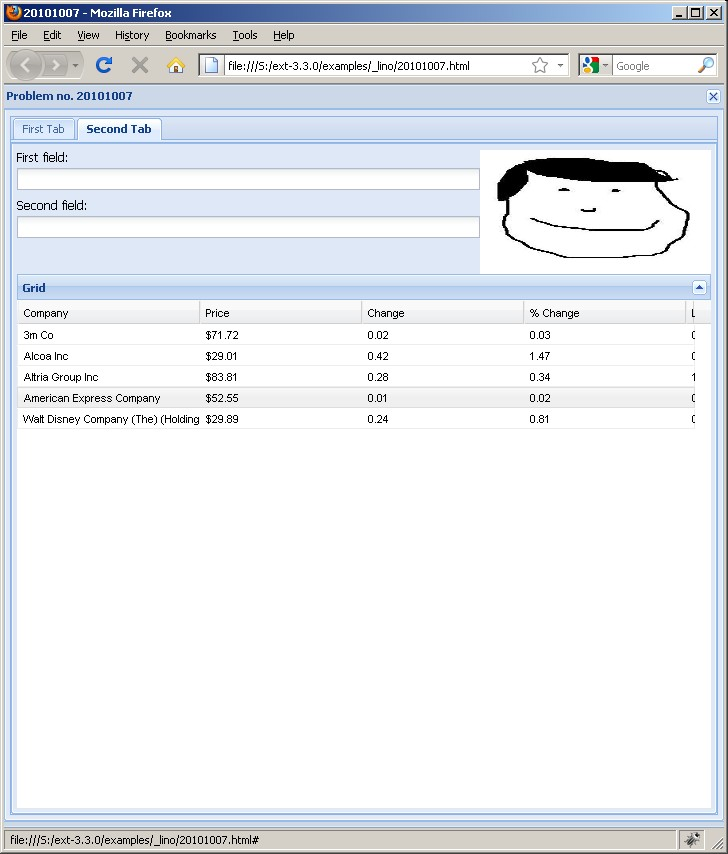
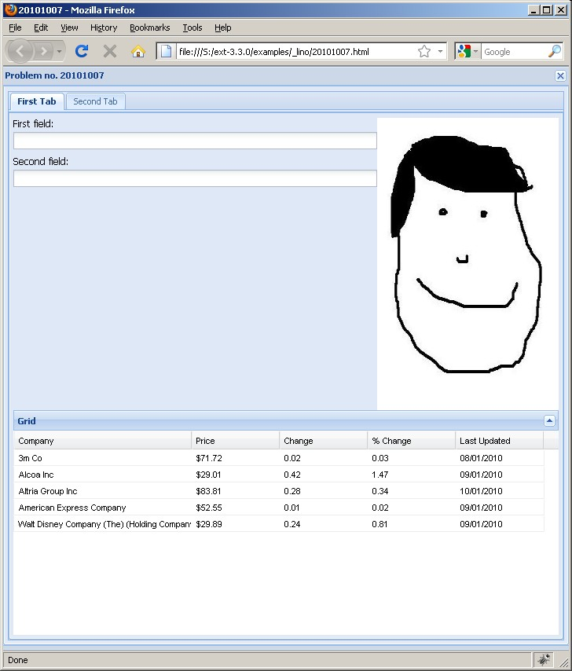
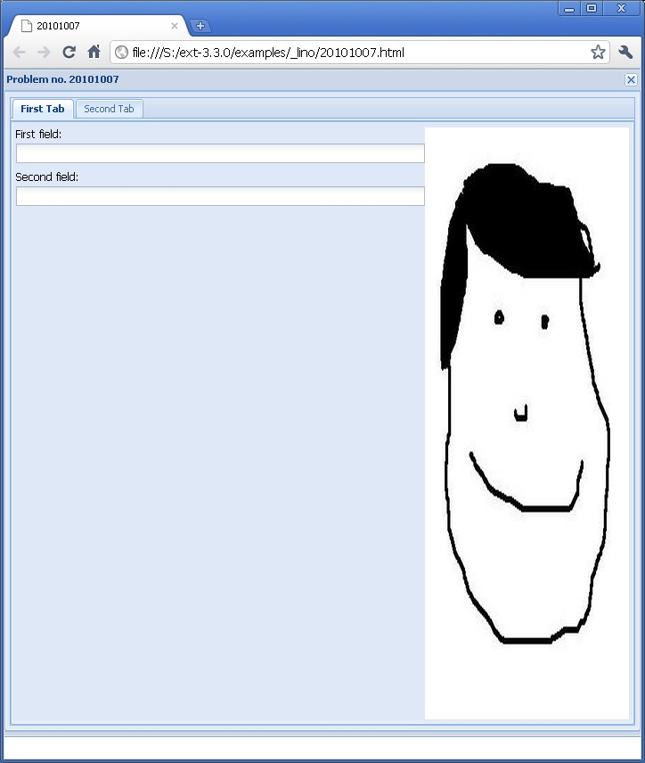
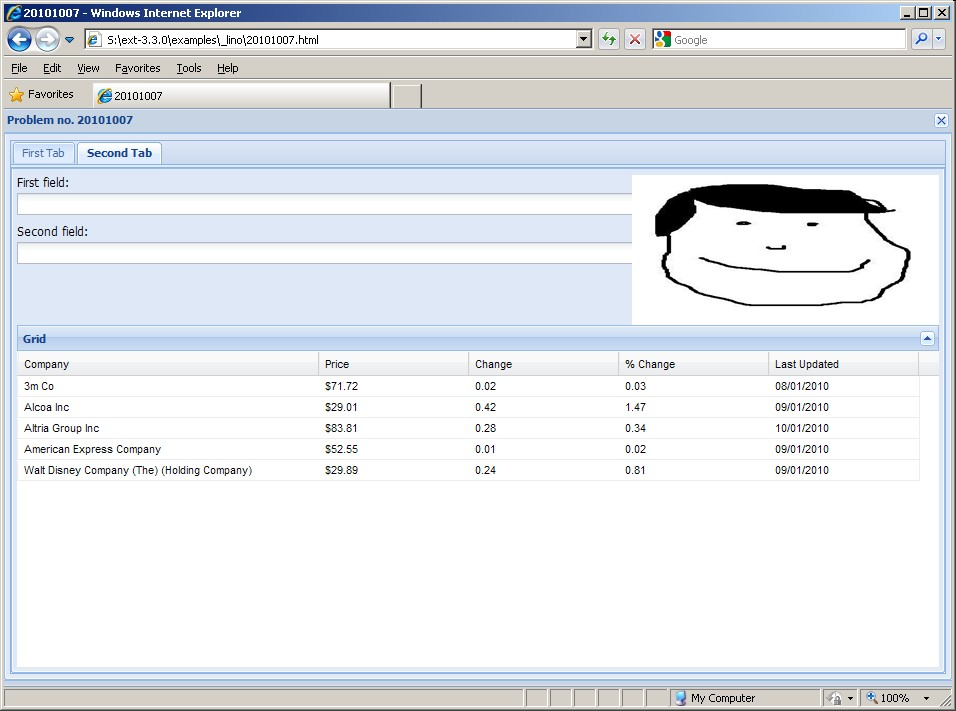
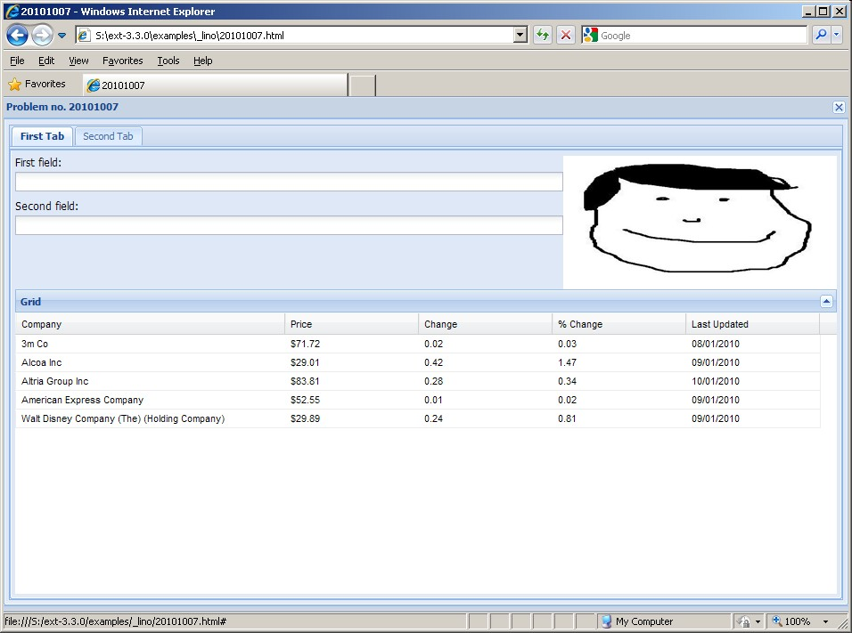
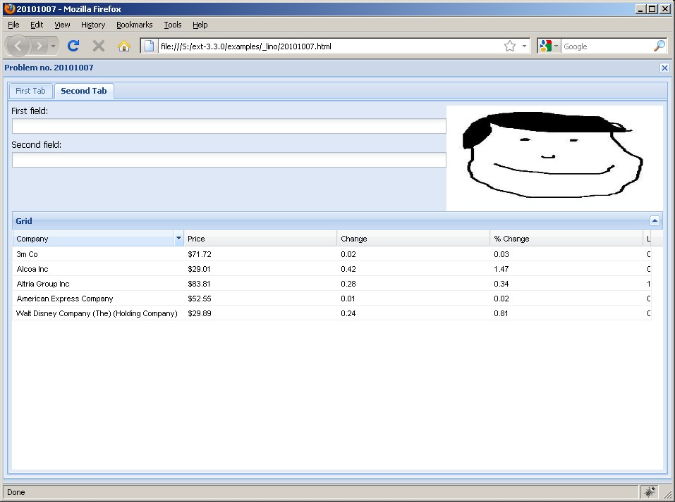
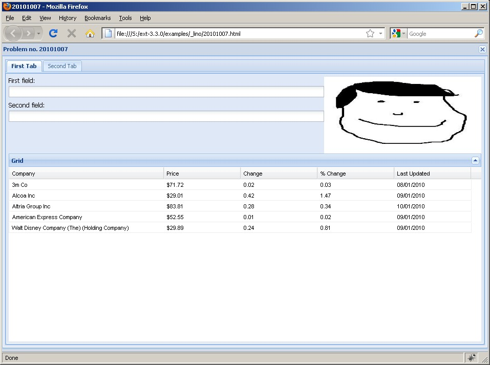
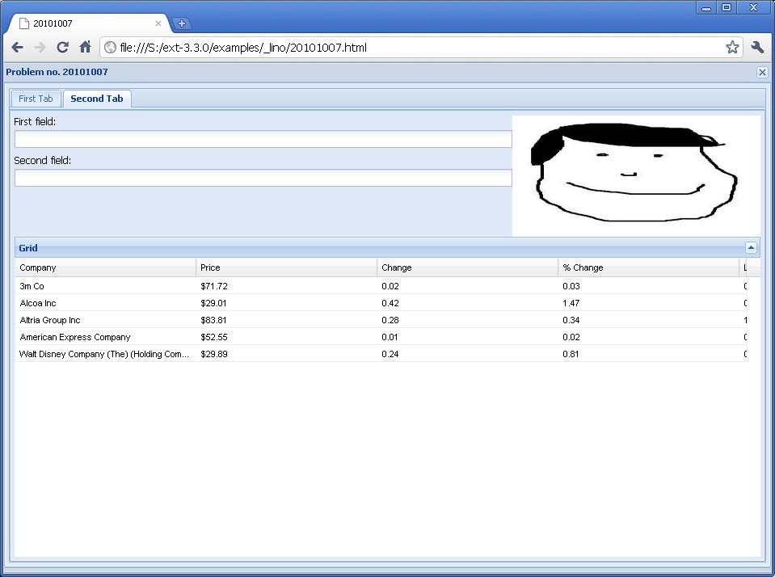

#1 [closed] : Wrong layout in Chrome and FF when tab gets activated
===================================================================

ExtJS Version 3.3.0.
Tested with Google Chrome, Firefox and Internet Explorer.
Platform: Windows.

The code in :srcref:`/extjs-showcases/20101007.html` creates a TabPanel containing two Panels 
that are identical except for their title.
The second Tab (the one that is active when the page loads) is laid out correctly in all browsers.
But when the user activates the first tab, there are layout problems in Chrome and Firefox (not in IE).
The following screenshots show the results.

   

   

 
.. |ch1| image:: 1-chrome-1.jpg
   :scale: 50
   

   
.. |left| replace:: After pages has been loaded 
    (correct in all tested browsers)

.. |right| replace:: After clicking on first tab (correct only in IE)
   
============= ============= ==============
Browser       |left|        |right|
------------- ------------- --------------
IE            |ie1|         |ie2|
------------- ------------- --------------
FF            |ff1|         |ff2|
------------- ------------- --------------
Chrome        |ch1|         |ch2|
============= ============= ==============

If you change the `activeTab` parameter from 0 to 1, then the second tab is correct but the first not.

Solution
--------

Condor `answered 
<http://www.sencha.com/forum/showthread.php?113652-Wrong-layout-in-Chrome-and-FF-when-tab-gets-activated&p=530144#post530144>`_ 
that "The vbox layout needs to know the height of the top panel 
when it renders, but in most cases the image won't have loaded yet, so it will get the wrong height." 
and recommended to avoid using relative widths and heights.
His suggested solution made it a lot better, 
but the best results come if I specify myself an absolute width and height::

  var image = new Ext.BoxComponent({
    flex: 14, 
    autoEl: {tag: 'img', src: 'empty.jpg', width:'100px', height:'150px'}
  });

I'd call this workaround good enough to mark my bug report as solved.
Although there are still small differences, especially in how the grid is rendered. 
But for these I'd rather find a more clear example and write a new bug report.

Here again the screenshots with this change.

   

   

 

   
.. |ch2b| image:: 1b-chrome-2.jpg
   :scale: 50
   
   
============= ============= ==============
Browser       |left|        |right|
------------- ------------- --------------
IE            |ie1b|        |ie2b|
------------- ------------- --------------
FF            |ff1b|        |ff2b|
------------- ------------- --------------
Chrome        |ch1b|        |ch2b|
============= ============= ==============

 
Blog entries
:blogref:`20101007`,
:blogref:`20101011`,
:blogref:`20101026`