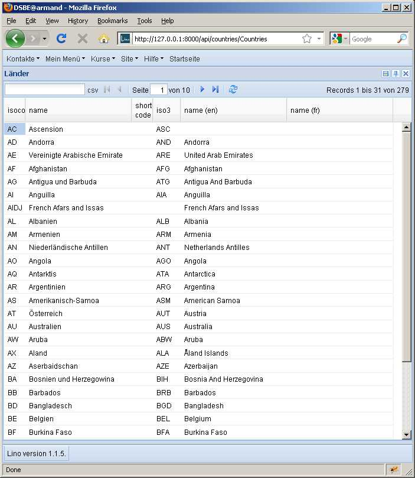

#27 : [closed] How to test Ajax PUT calls
=========================================

Here is how to test whether 
updating a field through the web interface 
works correctly.

I wrote this document because it took me some time to find 
out a few details.

First we play the case to be tested using a real browser.

   
Our example test case consists of opening this window, then:

- press :kbd:`F2` on the `name` field of country "Belgium"
- add an "s" at the end (changing "Belgium" to "Belgiums")
- press :kbd:`Enter` to send the request.

the test server now logs the request received from the client::

  PUT /api/countries/Countries/BE HTTP/1.1

FireBug tells us also more about the request::

  application/x-www-form-urlencoded
  name=Belgiens&nameHidden=Belgiens&fmt=json

and also the response::

  { "message": "Country #BE (Belgiens) wurde gespeichert.", "success": true }

If you are curious, this request is generated 
by `Lino.GridPanel.on_afteredit()` 
defined in :srcref:`linolib.js </lino/ui/extjs/linolib.js>`,
and the response is generated in :meth:`lino.ui.extjs.ext_ui.ExtUI.api_element_view`.

Now here is how to express this in a automatic test case::

  def test05(self):
      url ='/api/countries/Countries/BE'
      data = 'name=Belgienx&nameHidden=Belgienx&fmt=json'
      response = self.request_PUT(url,data)
      result = self.check_json_result(response,'message success')
      self.assertEqual(result['success'],True)
      
      response = self.client.get(url)
      result = self.check_json_result(response,'navinfo disable_delete data id title')
      self.assertEqual(result['data']['name'],'Belgienx')

The details that took me some time 
are documented in :mod:`lino.utils.test`.

The full source code of the above test is in
:srcref:`/lino/modlib/dsbe/tests/dsbe_tests.py`.

