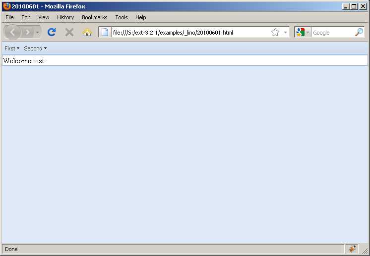

#3 [closed] : How to replace the content of a rendered component?
=================================================================

Status:
  This ticket is closed.
  I found myself the answer to this question before I could post it. see :srcref:`/extjs-showcases/20100711.html` and 
  :blogref:`20100709`.
  In :blogref:`20101015` I learned more.

I have an :extjs:`Ext.Viewport` with a border layout. The top element contains a menu. 
I would like the menu actions to dynamically render a component into the center area.

Here is a showcase to demonstrate what I mean::

  function showComp1(cmp) {
    cmp.render('main_area');
  }
  function showComp2(cmp) {
    ct = Ext.getCmp('main_area');
    ct.update('');
    cmp.render('main_area');
  }
  function showComp3(cmp) {
    Ext.getCmp('main_area').update(cmp);
  }

  showComp = showComp2;

  function cmd1() { showComp(sampleComp()) }
  function cmd2() { showComp(sampleComp()) }
  function cmd3() { showComp(sampleComp()) }
  function sampleComp() {
    return new Ext.Panel({title:'Sample component',
      html:'This is just a dummy. Actual application'+
      'returns GridPanels, FormPanels and others.'})
  }

  var main_menu = new Ext.Toolbar({ 
    region:'north',height:27,items:[
    { text: 'First', menu: [
      {text:'First command',handler:cmd1},
      {text:'Second command',handler:cmd2}] },
    { text: 'Second', menu: [
      {text:'Third command',handler:cmd3} ] }
  ]});  

  Ext.onReady(function() {
    var viewport = new Ext.Viewport({ 
      items: [ main_menu,
        { region: "center", id: "main_area", xtype: "panel", 
          html:'Welcome text.', layout: 'fit', autoHeight: true } 
      ], layout: "border" 
    });
    viewport.render('body');
  });

(A complete version of this code is `here <http://code.google.com/p/lino/source/browse/extjs-showcases/20100601.html>`_.)

Here is how this looks after loading the page:

.. image:: 20100601-2.jpg
   :scale: 50

My first guess (`showComp1()`) was to render the component into the main_area.
But this appends the component to existing content:

.. image:: 20100601-3.jpg
   :scale: 50

I want to forget about what was there before and replace the content by a new component.

My second guess (`showComp2()`) was after reading 
http://www.extjs.com/forum/showthread.php?42465-replace-content-for-extJS-Tabs :

.. image:: 20100601-4.jpg
   :scale: 50

This is almost what I want, but the ``ct.update('')`` created an empty DIV between menu and main_area. 

How can I get rid of this useless DIV? 

I tried `Ext.getCmp('main_area').update(cmp);` (`showComp3()`), which removes the empty DIV but inserts a string representation of the panel object:

.. image:: 20100601-5.jpg
   :scale: 50

Useful links:

* `Manual:Basic Application Design <http://www.extjs.com/learn/Manual:Basic_Application_Design>`_

* `Tutorial:Application Layout for Beginners <http://www.extjs.com/learn/Tutorial:Application_Layout_for_Beginners>`_

* Writing a Big Application in Ext 
  (`part 1 <http://blog.extjs.eu/know-how/writing-a-big-application-in-ext/>`_,
  `part 2 <http://blog.extjs.eu/know-how/writing-a-big-application-in-ext-part-2/>`_, 
  `part 3 <http://blog.extjs.eu/know-how/writing-a-big-application-in-ext-part-3/>`_)