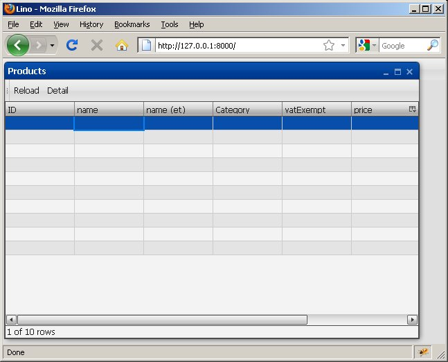
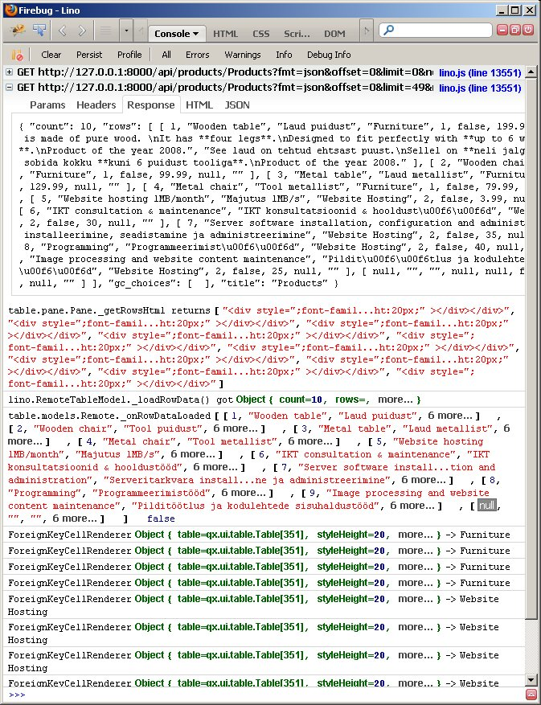

#33 [closed] : Qooxdoo Table remains empty
==========================================

(Question posted on 
`qooxdoo-devel <http://sourceforge.net/mailarchive/message.php?msg_id=27221846>`_)

Where is the bug? Here is another riddle which took me 
already a whole workday and for which I hope that some 
experienced Qx user will find the solution at a glance. 

Using the code below, 
I get a Table with the columnheaders and the correct number of 
rows, but all cells are empty. Here is how it looks:

   
   
The returned response looks ok (AFAICS)::   

  { "count": 10, 
    "rows": [ 
      [ 1, "Wooden table", "Laud puidust", "Furniture", 1, false, 199.99, 
        "This table is made of pure ... year 2008.", 
        "See laud on tehtud ... year 2008." ], 
      [ 2, "Wooden chair", "Tool puidust", "Furniture", 1, false, 99.99, null, "" ], 
      ...
      [ 9, "Image processing and website content maintenance", 
        "Pildit\u00f6\u00f6tlus ja kodulehtede sisuhaldust\u00f6\u00f6d", 
        "Website Hosting", 2, false, 25, null, "" ], 
      [ null, "", "", null, null, false, null, null, "" ] ], 
    "title": "Products" 
  }

I have the following class definitions::

  qx.Class.define('lino.RemoteTableModel', {

    extend : qx.ui.table.model.Remote,

    construct : function(window,url) {
      this.base(arguments);
      this.__url = url;
      this.__window = window;
    },

    members : {
      __url : null,
      __window : null,

      _loadRowCount : function()
      {
        var url = this.__url + "?fmt=json&offset=0&limit=0";
        this.__call(url, function(e) {
          var response = e.getContent();
          if (response) {
            this._onRowCountLoaded(response.count);
            this.__window.setCaption(response.title);
          } 
      },

      _loadRowData : function(firstRow, lastRow)
      {
        var url = this.__url + "?fmt=json&offset="+firstRow+"&limit="+(lastRow-firstRow);
        this.__call(url, function(e) {
          var response = e.getContent();
          console.log('lino.RemoteTableModel._loadRowData() got',response);
          this._onRowDataLoaded(response.rows)
        });
      },
      
      __call : function(url, callback) {
        var req = new qx.io.remote.Request(url, "GET", "application/json");
        req.addListener("completed", callback, this);
        req.send();
      }
    }
  });

  qx.Class.define("lino.TableWindow",
  {
    extend : qx.ui.window.Window,
    construct : function(app) {
        this.base(arguments);
        this.__app = app;
        this.__table = this.createTable();
        
        var toolbar = new qx.ui.toolbar.ToolBar();
        var part = new qx.ui.toolbar.Part();
        toolbar.add(part);
        var reload = new qx.ui.toolbar.Button('Reload');
        reload.addListener('execute',function(){
          var tm = this.__table.getTableModel();
          console.log("Reload. tm = ",tm);
          tm.reloadData();
        }, this);
        part.add(reload);
        this.setupToolbar(part);
        
        this.set({
          width: 600,
          height: 400,
          contentPadding : [ 0, 0, 0, 0 ],
          showClose: true
        });
        this.setLayout(new qx.ui.layout.VBox());
        this.add(toolbar);
        this.add(this.__table, {flex: 1});
        
    },
            
    members : {
        __app : null,
        __table : null,
        showWindow : function(cls) { 
          this.__app.showWindow(cls); 
        },
        createTableModel : function() {
          throw new Error("createTableModel is abstract");
        },
        setupToolbar: function(bar) { 
        }
    }
  });
  
  
  qx.Class.define("lino.products_Products_grid",
  {
    extend : lino.TableWindow,
    members : {
      content_type : 19,
      before_row_edit : function(record){}, 
      createTable : function() {
        var tm = new lino.RemoteTableModel(this,'/api/products/Products');
        tm.setColumns(
          [ "ID", "name", "name (et)", "Category", "vatExempt", "price", "description", "description (et)" ],
          [ 0, 1, 2, 3, 5, 6, 7, 8 ]
        ); // columnNameArr, columnIdArr
        var table = new qx.ui.table.Table(tm);
        var cm = table.getTableColumnModel();
        cm.setDataCellRenderer(3,new lino.ForeignKeyCellRenderer(3));
        cm.setDataCellRenderer(4,new qx.ui.table.cellrenderer.Boolean());
        return table;
      },
      setupToolbar: function(bar)
      {
        var btn = new qx.ui.toolbar.Button('Detail');
        btn.addListener('execute',function(){ alert("TODO..."); }, this);
        bar.add(btn);
      }
    }
  });  

The console output is:

   
As you can see, I also added some ``console.log`` calls to the Qooxdoo sources.
I currently can use only the built version because the application 
is running on a Django server and I didn't yet find a method to get 
the source version running (see :doc:`30` for that).

Solution
--------

There was an exception thrown during my self-written cell renderer. I
didn't even include the code of this class because I didn't expect that
kind of surprise (so I admit that you had no chance to find it). Here is
the buggy code::

 qx.Class.define("lino.ForeignKeyCellRenderer",
 {
  extend : qx.ui.table.cellrenderer.String,
  construct : function(colIndex)
  {
    this.base(arguments);
    this.__colIndex = colIndex;
  },
  members :
  {
    __colIndex : null,
    _getContentHtml : function(cellInfo) {
        if (cellInfo.rowData) {
            var s = cellInfo.rowData[this.__colIndex];
            return qx.bom.String.escape(s);   /** here it is **/
        }
        return "";
    }
  }
 });

The problem is that I call `qx.bom.String.escape` possibly with a null
value. Changing the line

::

  return qx.bom.String.escape(s);   /** here it is **/

into

::

  if (s) return qx.bom.String.escape(s);

did solve my problem.

And my new question is: how is it possible that I didn't get any
notification of that exception? I guess it is because I use the built
and not the source version? Is that correct?

