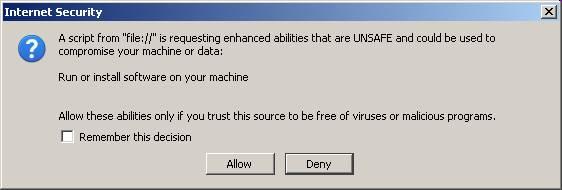

#45 : Make the client launch a WebDAV document
----------------------------------------------

.. todo::

  We didn't yet find a way to make the client launch Openoffice 
  or Word on a server-side file in a way that the user can save their 
  modifications back to the original file through WebDAV.

Lino's :mod:`lino.mixins.printable` module 
can generate .pdf, .rtf or .odt files into a directory 
located on the server, and this directory 
can be made accessible as a WebDAV location 
(see :doc:`/admin/webdav`).

When the client asks to print something, Lino generates that file 
and returns an URL of the generated document, which the client usually 
opens in a new browser window.

But how to have the browser open our document 
in a way that the user can save their 
modifications back to the original file through WebDAV?

Testing the WebDAV server
-------------------------

To test whether your WebDAV server works correctly and whether 
your Office suite supports direct WebDAV access, 
try the following:

Manually launch your favourite Office suite, type :kbd:`Ctrl+O` 
to open a file, and instead of a file name paste the URI::

  http://lino/media/webdav/userdocs/appyrtf/notes.Note-473.rtf

The URI might of course differ depending on your server. 
To get a "real" URL, enter your Lino database and click the "Print" 
button on a Note that has a NoteType that has AppyRtfBuildMethod set.

For LibreOffice, see also `Opening a Document Using WebDAV over HTTPS
<http://help.libreoffice.org/Common/Opening_a_Document_Using_WebDAV_over_HTTPS>`_ 
(which maybe wrongly claims that https is needed; seems that simple http works as well).

Another test is to launch you Office suite from a command line::

  "C:\Program Files\...\foo.exe"  http://lino/media/webdav/userdocs/appyrtf/notes.Note-473.rtf
  
Where ``C:\Program Files\...\foo.exe`` is the full path of your favourite Office suite.

Alfresco
--------

Alfresco These are Microsoft centric solutions that won't work on other platforms.

Some quotes from `How to edit MSoffice documents online
<http://forums.alfresco.com/en/viewtopic.php?f=3&t=19885>`_:
discussion thread (2009-2010 in Alfresco forum):

- online editing "requires Internet Explorer with ActiveX scripting enabled"
- There is a Firefox add-on to support Webdav that needs to be installed:
  `Open As Webfolder <https://addons.mozilla.org/en-US/firefox/addon/540>`_
  
- Another Firefox-AddOn which works for me: 
  `IE-Tab2 <https://addons.mozilla.org/en-US/firefox/addon/92382/>`_

But "Note that this requires the Microsoft Webfolder client to be installed 
on the machine. Thus, it's unlikely to work on Windows Vista or Windows 7 
installations unless the Webfolder client was installed separately."

Making webdav files appear to be local
--------------------------------------

In most cases the following is not necessary
as the major Office suites now support direct webdav editing.

If the client's Office suite does not support to work directly on 
WebDAV documents, Lino offers a trick to have webdav media files 
appear local to the client machine.

On a Windows client it seems possible to map 
a drive letter (on Windows) or a directory (on UNIX) 
to a WebDAV location.
We should write more detailed instructions on this.
CIFS
http://wiki.ubuntuusers.de/samba_client_cifs

We can configure 
:attr:`lino.Lino.webdav_root` and 
:attr:`lino.Lino.webdav_url`
so that the Lino server can translate the filename using 
that information.

But browsers usually don't allow Javascript to do 
something like this::

  window.open('file:///W:/userdocs/test.rtf')

If you manually enter such a link in the address field of a browser, 
it will (depending on your settings) open the file and launch 
Writer or Word, *but* first it will download the file.

A "command server" on each client?
----------------------------------

On a Windows machine, if we manually type in a DOS box::

  start http://lino/media/webdav/userdocs/test.rtf
  
then we get the expected result.

So one workaround might be to have a small "cmdserver" 
daemon that clients need to install and run on their machine,
at least if they want the feature of editing .rtf files.

This would be a minimal HTTP server which would react to a GET `http://localhost:8910/userdocs/test.rtf` by executing the 
corresponding file.    
Here is a functional but neither secure nor user-friendly 
proof-of-concept implementation of such a daemon:

.. literalinclude:: 45/cmdserver.py
   
        
We could make the `cmdserver` method more user-friendly and secure, 
but it still remains a very strange workaround. 

But is there really no easier solution?
For many system administrators it is not a solution at all since 
installing such a command server on each client causes additional 
complexity as well as security risks.

Easier solutions
----------------

The following sections describe different approaches we have tried.

Using browser-specific methods
------------------------------

If our clients were Internet Explorers, we could simply do::

  

For Firefox there is an equivalent approach:

| https://developer.mozilla.org/en/Code_snippets/Running_applications
| https://developer.mozilla.org/en/XPCOM_Interface_Reference/nsIProcess
| http://forums.mozillazine.org/viewtopic.php?f=19&t=803615&start=0
| http://stackoverflow.com/questions/2017743/how-to-call-a-function-in-firefox-extension-from-a-html-button
| http://stackoverflow.com/questions/1374927/launch-file-from-firefox-chrome

For other browsers there are probably similar methods.
Here is a proof of concept that works on Firefox and MSIE:

.. literalinclude:: 45/startfile.js.html

Firefox will ask the user "A script from XXX is requesting enhanced abilities that are UNSAFE and could be used to comprimise your machine or data...":

   
It doesn't yet work in Chrome 
(and it seems that `an implementation might be difficult
<http://stackoverflow.com/questions/2537772/how-can-i-launch-a-system-command-via-javascript-in-google-chrome>`_).

And of course, the main issue of this snippet
is that we must tell the Javascript code 
which application to start.

Is there a method in Firefox to find out the full path 
application associated with a given file type
in the client's desktop? 
In other words, 
when you doubleclick on a file on your desktop, 
then the operating system (Windows, KDE, Gnome...)
has configured a list that map the file's extension 
to an executable that will be launched with the name 
of the file as parameter.

Using a Java applet 
-------------------

Examples to be published. Seems to be possible, 
but this requires the Java RTE which will probably 
slow town client machines.

Using the DownloadWith browser plugin
-------------------------------------

The following article (posted January 2008 by marinew) 
perfectly reflects our problem:

http://forums.mozillazine.org/viewtopic.php?p=3203256

They solved it using `DownloadWith <http://downloadwith.mozdev.org/>`_. 
But this Firefox plugin is not compatible with newer 
Firefox versions, and it is no longer maintained.
("L'auteur a malheureusement abandonné le développement de son extension.")

Using a custom URL protocol
---------------------------

- `We need a webdav:// URL scheme!
  <http://kartik-log.blogspot.com/2006/01/we-need-webdav-url-scheme.html>`_ 
  (Kartick's Log, January 2006)

- `Registering an Application to a URL Protocol
  <http://msdn.microsoft.com/en-us/library/aa767914.aspx>`_
  
- Freeware `viewer <http://www.nirsoft.net/utils/url_protocol_view.html>`_ 
  for URL protocols.

Here is a simple `.reg` file that installs LibreOffice 
as handler for ``webdav:`` URLs:

.. literalinclude:: 45/webdav.reg

To try it: download :srcref:`/docs/tickets/45/webdav.reg` and doubleclick on it.

Here is a similar file for MS Office:
:srcref:`/docs/tickets/45/webdav_mso.reg`.

Problem: The specified URL protocol handler then receives 
``webdav://host/path.rtf`` 
as command line argument, 
but the argumentneeds first to be converted 
to ``https://host/path.rtf``.

LibreOffice solves this using the magic protocol name 
``vnd.sun.star.webdav`` 
instead of
``webdav``.
This activates the 
`WebDAV Content Provider
<http://wiki.services.openoffice.org/wiki/Documentation/DevGuide/AppendixC/The_WebDAV_Content_Provider>`_ 
who does the conversion.
This works, but only when the WebDAV server is on 
``http``, 
not on ``https``.

