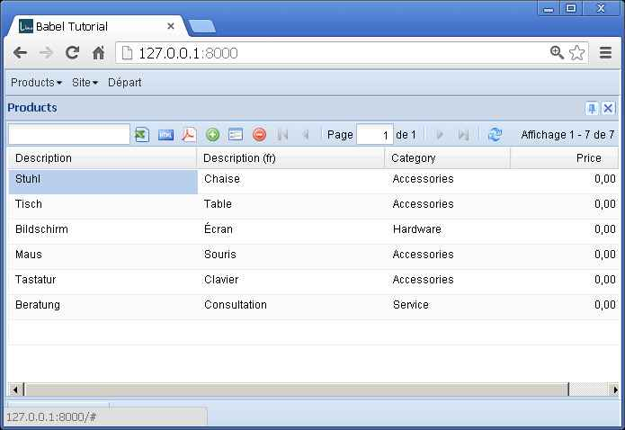
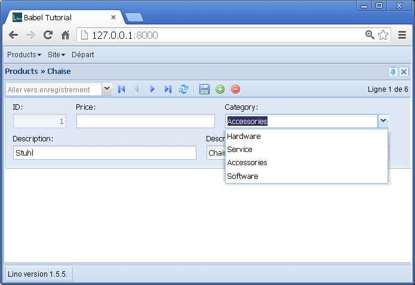

.. _mldbc_tutorial:

======================
Multilingual databases
======================

One of Lino's key features is 
:ref:`support for multilingual database content  <mldbc>`.
This tutorial tries to explain what it is.

Note: If you have a :ref:`djangosite_local <site:djangosite_local>` 
directory with your 
:attr:`extjs_root <lino.Lino.extjs_root>` defined, 
then you can run directly from the Lino source repository:

.. code-block:: bash

  $ cd ~/snapshots/lino/lino/apps/babel_tutorial
  $ mkdir media
  $ python manage.py testserver demo
  Creating test database for alias 'default'...
  INFO Analyzing models...
  INFO Loading ~/snapshots/lino/lino/apps/babel_tutorial/fixtures/demo.py...
  Installed 6 object(s) from 1 fixture(s)
  Validating models...

  0 errors found
  Django version 1.4.2, using settings 'lino.projects.babel_tutorial.settings'
  Development server is running at http://127.0.0.1:8000/
  Quit the server with CTRL-BREAK.  
  

The `media` directory must exist, otherwise the 
development server won't populate it.

Screenshots
-----------

The screenshots on the left have been taken on a server with 
``languages = ['en']``,
those on the right on a server with 
``languages = ['de','fr']``.

Note that we are **not** talking about Internationalization (i18n) here.
*Internationalization* is when the *user interface* is in different languages.
Lino has nothing to add to the existing Django techniques about
`Internationalization
<https://docs.djangoproject.com/en/dev/topics/i18n/>`__,
that's why we deliberately didn't translate the user interface in this tutorial.

.. image:: babel1a.jpg
    :scale: 50
    

    
.. image:: babel2a.jpg
    :scale: 50
    
.. image:: babel2b.jpg
    :scale: 50
    
.. image:: babel3a.jpg
    :scale: 50
    

    

The :xfile:`settings.py` file
-----------------------------

.. literalinclude:: ../../lino/apps/babel_tutorial/settings.py

This is where you specify the :attr:`lino.Lino.languages` setting.

The :xfile:`models.py` file
---------------------------

.. literalinclude:: ../../lino/apps/babel_tutorial/models.py

Note that this is the first time we use a 
:class:`dd.ChoiceList <lino.core.choicelists.ChoiceList>`
they deserve another tutorial on their own.

The `demo` fixture
------------------

.. literalinclude:: ../../lino/apps/babel_tutorial/fixtures/demo.py

Note how the application developer doesn't know which 
will be the :attr:`lino.Lino.languages` setting at runtime.

Of course the fixture above supposes a single person who knows 
all the languages, but that's just because we are simplifying. 
In reality you can do it as sophisticated as you want, 
reading the content from different sources.
