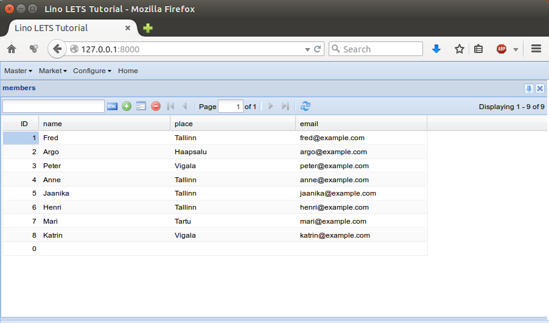
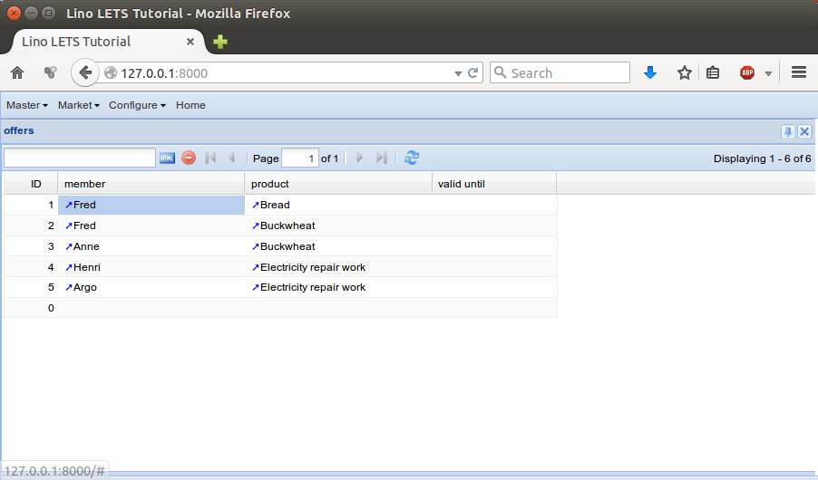

.. _lino.tutorial.lets:

=============================
A Local Exchange Trade System
=============================

.. this document is part of the Lino test suite. To test only this
  document, run::

   $ python setup.py test -s tests.DocsTests.test_lets

In this tutorial we are going to write a new Lino application from
scratch.  It is also an illustration for our way of describing an
application.  We hope that this encourages you to start writing your
own Lino application.

Our fictive application is a website of a Local Exchange Trade System
(`LETS
<http://en.wikipedia.org/wiki/Local_exchange_trading_system>`_). The
members of that site would register the products and services they
want to sell or to buy. The goal is to connect the providers and the
customers.

.. contents::
   :local:

Your first application development project
==========================================

(Not finished. Don't hesitate to ask Luc.)

Start your own local project, called "mylets" as a copy of this tutorial::

  $ mkdir ~/projects/mylets
  $ cd ~/projects/mylets
  $ cp -a ~/repositories/lino/docs/tutorials/lets/* .

Edit your copies of certain files:

- In :xfile:`manage.py` ...
- In :xfile:`settings.py` ...

What is a technical specification?
==================================

The "technical specification" of an application is a document which
describes what an application does (or is expected to do).

Such a description is an important document when doing software
development in a team.  Writing this document is the job of the
**analyst**.  The analyst communicates directly with the customer and
formulates their needs. The salesman then uses this document when
discussion with the customer about the price.  The developer must be
able to understand this document and to discuss with the analyst about
it.

The salesman, the analyst and the developer can be a single person in
a small team. But even then it is a good habit to write a technical
specification.

For a Lino application, the technical specification will include the
following elements.

- the **database structure** : i.e. the list of **models** to be used.
  Each model has a name and a list of **fields**.  Each field of a
  model has at least a name and a type.

- a **menu structure**

- the **layout** of detail forms

- the content of the **main page**

- the **user profiles**

Describing a database structure
===============================

A **textual** description of your models makes certain things clear
between the customer and the developer. It is good to agree with your
customer on the meaning of certain words.  

Here is a textual description for our fictive application:

.. admonition:: Database models

    - **Products** : one row for every product or service. We keep it
      simple and just record the designation for our products. We don't
      even record a price.

    - **Members** : the people who use this site to register their offers
      and demands. For each member we record their contact data such as
      place and email.

    - An **Offer** is when a given member declares that they want to *sell*
      a given product.

    - A **Demand** is when a given member declares that they want to *buy* a
      given product.

    - Every member is located in a given **Place**. And in a future
      version we want to add filtering on offers and demands limited to
      the place.

Note that we don't pretend that this structure is actually useful,
optimal and cool.  It is probably a bit too simple for a real-life
website.  But we *imagine* that this is what our customer *asks* us to
do.

While words are good, a picture says more than a thousand words.  So
here is a **graphical representation** of our structure:

.. graphviz:: 

   digraph foo  {

       graph [renderer="neato"]

       node [shape=box]
       node [style=filled]
           node [fontname="times bold", fillcolor=red]  
              Product Member
           node [fontname="times" fillcolor=gold]  Offer  Demand
           node [fontname="times italic" fillcolor=lightblue]  Place

       Product -> Offer[arrowhead="inv"]
       Product -> Demand[arrowhead="inv"]
    
       Offer -> Member[taillabel="provider", labelangle="-90", labeldistance="2"];
       Demand -> Member[taillabel="customer", labelangle="90", labeldistance="2"];
       Member ->  Place;

  }

This way of visualizing a database structure is a bit uncommon
(because Luc "invented" it before the `UML
<https://de.wikipedia.org/wiki/Unified_Modeling_Language>`_ was
formulated), but we find it intuitive and useful.  The basic rules
are:

- Every **node** on the diagram represents a database model.
- Every **arrow** on the diagram represents a `ForeignKey`.  We prefer
  to use the word *pointer* instead of *ForeignKey* when talking with
  a customer because that's more intuitive.

- We display the **name of a pointer** only if it differs from the
  model it points to. For example the arrow from *Offer* to *Product*
  is a FK field called `product`, defined on the *Offer* model. We do
  not display the name `product` on our diagram because that would be
  a waste of place.

The colors of this diagram are our habit of grouping the models into
three "data categories":

- **red** is for **master data** (i.e. relatively stable data)
- **yellow** is for **moving data** (i.e. data which changes
  relatively often)
- **blue** is for **configuration data** (i.e. data which is rather in
  background and accessible only to site administrators)

Now here is the :srcref:`models.py </docs/tutorials/lets/models.py>`
file which defines these database models:

.. literalinclude:: models.py

Yes, the two `displayfield` deserve some explanation. These are
virtual fields defined on the model.

Note about many-to-many relationships
=====================================

There are two `many-to-many relationships
<https://docs.djangoproject.com/en/1.7/topics/db/examples/many_to_many/>`_
between *Member* and *Product*: 

- A given member can *offer* multiple products, and a given product
  can *be offered* by multiple members. We can call this the
  **providers** of a product.

- A given member can *want* multiple products, and a given product can
  *be wanted* by multiple members. We can call this the **customers** of
  a product.

Using Django's interface for `many-to-many relationships
<https://docs.djangoproject.com/en/1.7/topics/db/examples/many_to_many/>`_, 
we can express this as follows::

    providers = models.ManyToManyField(
        'lets.Member', through='lets.Offer', related_name='offered_products')
    customers = models.ManyToManyField(
        'lets.Member', through='lets.Demand', related_name='wanted_products')

Which you can read as follows:

- *Offer* is the "intermediate model" used "to govern the m2m relation
  *Product.providers* / *Member.offered_products*.

- *Demand* is the intermediate model used to govern the m2m relation
  *Product.customers* / *Member.wanted_products*.

A *ManyToManyField* is originally a shortcut for telling Django to
create an automatic, "invisible", additional model, with two
ForeignKey fields.  But in most real-life situations you anyway want
to define what Django calls "`extra fields on many-to-many
relationships
<https://docs.djangoproject.com/en/1.7/topics/db/models/#intermediary-manytomany>`_",
and thus you must explicitly name that "intermediate model" of your
ManyToManyField.  That's why we recommend to always explicitly name
the intermediate models of your m2m relations.

Designing your tables
=====================

For this tutorial we defined the tables in a separate file
:file:`ui.py`.

.. literalinclude:: ui.py

Writing demo data
=================

It is important to get some fictive data which corresponds more or
less to the reality of your customer.  Here is the demo data for this
tutorial.

.. literalinclude:: fixtures/demo.py

As soon as you have written such a fixture, you can start to write
test cases.  

Writing test cases
==================

The following code snippets are so-called "doctests",
they are both a **visualisation of your demo data** (which you might
show to your customer) and a part of the test suite of your
application (which you invoke with::

  $ python manage.py test

The above command will run the following code snippets in a subprocess
and check whether their output is the same as the one displayed here.

Doctests usually need to do some initialization.

>>> from __future__ import print_function
>>> from lino.api.shell import *
>>> from lino.api import rt

Since doctests run on a temporary database, we need to load our
fixture each time this document is being tested.

>>> from django.core.management import call_command
>>> call_command('initdb', 'demo', interactive=False, verbosity=0)

    
Show the list of members:    

>>> rt.show(lets.Members)
... #doctest: +NORMALIZE_WHITESPACE -REPORT_UDIFF
========= ===================== ========== =========================== =====================
 name      email                 place      offered_products            wanted_products
--------- --------------------- ---------- --------------------------- ---------------------
 Fred      fred@example.com      Tallinn    *Bread*, *Buckwheat*
 Argo      argo@example.com      Haapsalu   *Electricity repair work*
 Peter     peter@example.com     Vigala
 Anne      anne@example.com      Tallinn    *Buckwheat*
 Jaanika   jaanika@example.com   Tallinn
 Henri     henri@example.com     Tallinn    *Electricity repair work*   *Buckwheat*, *Eggs*
 Mari      mari@example.com      Tartu                                  *Eggs*
 Katrin    katrin@example.com    Vigala
========= ===================== ========== =========================== =====================
<BLANKLINE>

The `Products` table shows all products in alphabetical order:

>>> rt.show(lets.Products)
... #doctest: +NORMALIZE_WHITESPACE -REPORT_UDIFF
==== ========================= ================= =================
 ID   name                      Offered by        Wanted by
---- ------------------------- ----------------- -----------------
 1    Bread                     *Fred*
 2    Buckwheat                 *Fred*, *Anne*    *Henri*
 5    Building repair work
 3    Eggs                                        *Henri*, *Mari*
 6    Electricity repair work   *Henri*, *Argo*
 4    Sanitary repair work
==== ========================= ================= =================
<BLANKLINE>

The `Offers` table show all offers.

>>> rt.show(lets.Offers)
... #doctest: +NORMALIZE_WHITESPACE +REPORT_UDIFF
==== ======== ========================= =============
 ID   member   product                   valid until
---- -------- ------------------------- -------------
 1    Fred     Bread
 2    Fred     Buckwheat
 3    Anne     Buckwheat
 4    Henri    Electricity repair work
 5    Argo     Electricity repair work
==== ======== ========================= =============
<BLANKLINE>

The *ActiveProducts* table is an example of how to handle customized
complex filter conditions.  It is a subclass of `Products`, but adds
filter conditions so that only "active" products are shown, i.e. for
which there is at least one offer or one demand.  It also specifies
`column_names` to show the two virtual fields `offered_by` and
`wanted_by`.

>>> rt.show(lets.ActiveProducts)
... #doctest: +NORMALIZE_WHITESPACE +REPORT_UDIFF
========================= ================= =================
 name                      Offered by        Wanted by
------------------------- ----------------- -----------------
 Bread                     *Fred*
 Buckwheat                 *Fred*, *Anne*    *Henri*
 Eggs                                        *Henri*, *Mari*
 Electricity repair work   *Henri*, *Argo*
========================= ================= =================
<BLANKLINE>

Menu structure and main page
============================

Another thing to discuss with your customer during analysis is the
**menu structure**. 

We imagine that they want something like this:

.. admonition:: Main menu 

    - **Master**:

      - Products -- show the list of products
      - Members -- show the list of members

    - **Market**

      - Offers  -- show the full list of all offers
      - Demands  -- show the full list of all demands

We imagine that they want the **main page** to display a list of
products available for exchange (in other words the *ActiveProducts*
table defined above).

Here is how we express these things by defining two methods
:meth:`setup_menu <lino.core.site.Site.setup_menu>` and
:meth:`get_admin_main_items
<lino.core.site.Site.get_admin_main_items>` in our
:xfile:`settings.py` file.

.. literalinclude:: settings.py

We can show the main menu in a doctest:

>>> ses = rt.login()
>>> ses.show_menu()
... #doctest: +ELLIPSIS +NORMALIZE_WHITESPACE +REPORT_UDIFF
- Master : members, products
- Market : offers, demands
- Configure : places

Form layouts
============

Note the `detail_layout` attributes of certain tables.  They define
the **layout** of the **detail window** for these database models (a
detail window is what Lino opens when the user double-clicks on a
given row).

Layouts are another thing to discuss with your customer during
analysis, and therefore they should be part of a specification.

.. textimage:: t3a-3.jpg
    :scale: 50%

    The detail window of a **Product** should show the data fields and
    two slave tables, one showing the the **offers** and another with
    the **demands** for this product.

    Here is the code for this::

        detail_layout = """
        id name
        OffersByProduct DemandsByProduct
        """
    
When seeing the code on the left, you should be able to imagine
something like the picture on the right.

The web interface
=================

Now you are ready to write a "first draft" prototype.  The goal of
such a prototype is to have something to show to your customer that
looks a little bit like the final product, and with wich you can play
to test whether your analysis of the database structure is okay.  

Please explore the files in :srcref:`docs/tutorials/lets`, copy them
to a local project directory and try to get the prototype running.

You will need run the following command to populate your database with
some demo data::

  python manage.py initdb_demo
  
Then you start the development web server using::

  python manage.py runserver

And point your browser to http://127.0.0.1:8000/

Here are some screenshots.

.. image:: a.png
    :scale: 70
    
.. image:: b.png
    :scale: 70
    

    
.. image:: d.png
    :scale: 70
    

    
.. image:: members_insert.png
    :scale: 30
    
.. image:: members_insert.png
    :scale: 30
    

Summary
=======

In this tutorial you learned about the workflow of developing Lino
applications. Why it is important to write a technical specification,
how it should look like, how you translate it into Lino source code.

You also started your own copy of the example application, you can run
the development server and reproduce the screenshots on your machine.
