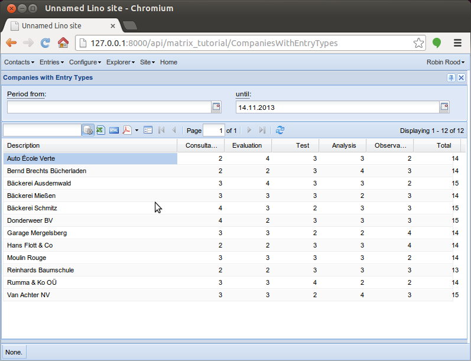

.. _lino.tutorial.matrix:

Dynamic tables (Matrixes)
-------------------------

This tutorial shows how to use tables with dynamic columns.
Accidentally it also introduces a usage example for `parameters`, 
a feature which is not yet covered by any tutorial.

It extends the application created in :ref:`lino.tutorial.watch`
(so you should do that tutorial before reading on here).
We add an `EntryType` model and a `CompaniesWithEntryTypes` 
table which is a matrix with one row per `Company` and one 
column per `EntryType`.

This table shows for each cell the number of 
entries (of that company and that type).

TODO: clicking on the number in every cell should open the list 
of these entries.

Here is our :mod:`models` module. 
We also introduce filter parameters for the `Entries` table.

.. literalinclude:: models.py

You can play with this application by cloning the latest development 
version of Lino, then ``cd`` to the :file:`/docs/tutorials/matrix_tutorial` 
directory where you can run::

    $ python manage.py initdb_demo
    $ mkdir media 
    $ python manage.py runserver
    

   
A known problem is that after changing or adding an EntryType, 
the server must restart before the modified column becomes visible.

Note also the :file:`fixtures/demo.py` file which 
generates the demo entries 
using :ref:`dpy`:

.. literalinclude:: fixtures/demo.py

  

