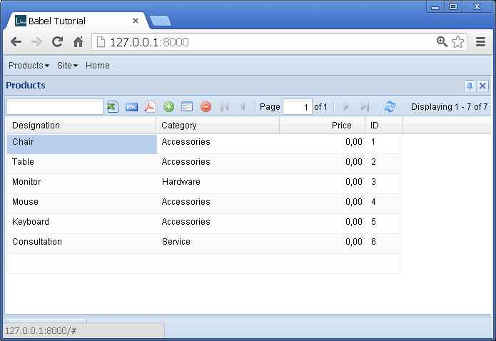
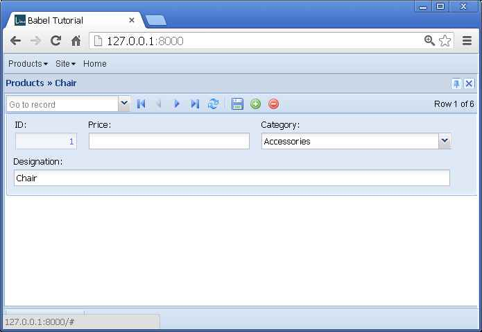
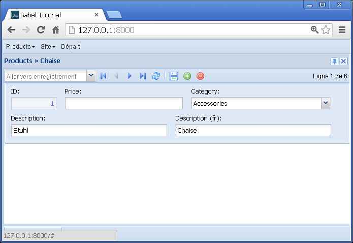
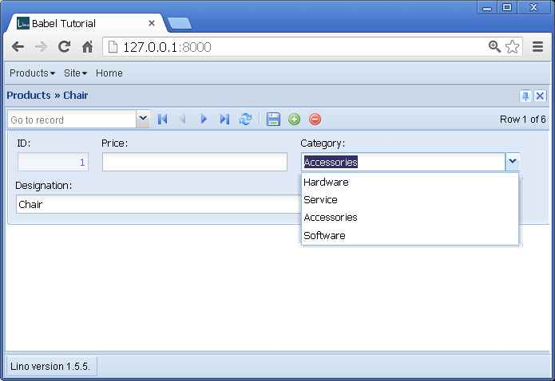

.. _mldbc_tutorial:

=============================
Multilingual database content
=============================

One feature of Lino is its built-in support for :ref:`single-table
multilingual database content <mldbc>`.  This tutorial explains what
it is.

Note that we are **not** talking about Internationalization (i18n)
here.  *Internationalization* is when the *user interface* is in
different languages.  Lino has nothing to add to the existing Django
techniques about `Internationalization
<https://docs.djangoproject.com/en/dev/topics/i18n/>`__, that's why we
deliberately didn't translate the user interface in this tutorial.

When to use BabelFields
-----------------------

Imagine a Canadian company which wants to print catalogs and price
offers in an English and a French version, depending on the customer's
preferred language.  They don't want to maintain different product
tables because it is one company, one accounting, and prices are the
same in French and in English.  They need a Products table like this:

  +------------------+------------------+-------------+-------+----+
  | Designation (en) | Designation (fr) | Category    | Price | ID |
  +==================+==================+=============+=======+====+
  | Chair            | Chaise           | Accessories | 29.95 | 1  |
  +------------------+------------------+-------------+-------+----+
  | Table            | Table            | Accessories | 89.95 | 2  |
  +------------------+------------------+-------------+-------+----+
  | Monitor          | Écran            | Hardware    | 19.95 | 3  |
  +------------------+------------------+-------------+-------+----+
  | Mouse            | Souris           | Accessories |  2.95 | 4  |
  +------------------+------------------+-------------+-------+----+
  | Keyboard         | Clavier          | Accessories |  4.95 | 5  |
  +------------------+------------------+-------------+-------+----+

Now imagine that your application is being used not only in Canada but
also in the United States.  Of course, your US customers don't want to
have a "useless" column for the French designation of their products.

This is where you want multi-lingual database content.

In that case you would simply

- use :class:`BabelCharField <lino.utils.mldbc.fields.BabelCharField>`
  instead of Django's `CharField` for every translatable field and

- set the :attr:`languages <lino.core.site.Site.languages>` attribute
  to ``"en"`` for US customers and to ``"en fr"`` for Canadian
  customers.

An example
==========

Let's create a little Site with the following :xfile:`models.py` file:

.. literalinclude:: models.py

..
  >>> from __future__ import print_function
  >>> from lino.api.shell import *
  >>> Product = mldbc.Product
  

The :xfile:`settings.py` file is where you specify the
:attr:`languages <lino.core.site.Site.languages>` setting of a given
Site instance:

.. literalinclude:: settings.py
  

The `demo` fixture
------------------

Now we install some demo data using a :ref:`Python fixture <dpy>`:

.. literalinclude:: fixtures/demo.py

Note how the application developer doesn't know which :attr:`languages
<lino.core.site.Site.languages>` will be set at runtime.

Of course the fixture above supposes a single person who knows all the
languages, but that's just because we are simplifying.  In reality you
can do it as sophisticated as you want, reading the content from
different sources.

Here is how to install this data:

.. code-block:: bash

  $ python manage.py initdb_demo

Using the shell
---------------

Alternatively you might do the same by opening the interactive Django
shell::

  $ python manage.py shell

And typing the following:

>>> from django.core.management import call_command
>>> import doctest
>>> doctest.ELLIPSIS_MARKER = '-etc-'
>>> call_command('initdb', 'demo', interactive=False) #doctest: +ELLIPSIS +NORMALIZE_WHITESPACE +REPORT_UDIFF
-etc-Creating tables-etc-...
-etc-Installing custom SQL-etc-...
-etc-
Installed 6 object(s) from 1 fixture(s)

You can print a catalog in different languages:

>>> print(', '.join([unicode(p) for p in Product.objects.all()]))
Chair, Table, Monitor, Mouse, Keyboard, Consultation

>>> from django.utils import translation
>>> with translation.override('fr'):
...     print(', '.join([unicode(p) for p in Product.objects.all()]))
Chaise, Table, Ecran, Souris, Clavier, Consultation

Here is how we got the above table:

>>> from lino.api import rt
>>> rt.show(mldbc.Products)
==================== ================== ============= ============
 Designation          Designation (fr)   Category      Price
-------------------- ------------------ ------------- ------------
 Chair                Chaise             Accessories   29,95
 Table                Table              Accessories   89,95
 Monitor              Ecran              Hardware      19,95
 Mouse                Souris             Accessories   2,95
 Keyboard             Clavier            Accessories   4,95
 Consultation         Consultation       Service       59,95
 **Total (6 rows)**                                    **207,70**
==================== ================== ============= ============
<BLANKLINE>

Using the web interface
-----------------------

Note: If you have a development version of Lino, then you can run
directly from the Lino source repository:

.. code-block:: bash

  $ cd ~/snapshots/lino/docs/tutorials/mldbc
  $ mkdir media
  $ python manage.py initdb_demo
  $ python manage.py testserver demo
  Creating test database for alias 'default'...
  INFO Analyzing models...
  INFO Loading ~/snapshots/lino/lino/docs/tutorials/mldbc/fixtures/demo.py...
  Installed 6 object(s) from 1 fixture(s)
  Validating models...

  0 errors found
  Django version 1.6.8, using settings 'mldbc.settings'
  Development server is running at http://127.0.0.1:8000/
  Quit the server with CTRL-BREAK.  
 

The `media` directory must exist, otherwise the 
development server won't populate it.

Screenshots
-----------

The screenshots on the left have been taken on a server with 
``languages = ['en']``,
those on the right on a server with 
``languages = ['de','fr']``.

    
.. image:: babel1b.jpg
    :scale: 50
    

    

    

    
.. image:: babel3b.jpg
    :scale: 50
    

The :xfile:`settings.py` file
-----------------------------

.. literalinclude:: settings.py

This is where you specify the :setting:`languages` setting.

The :xfile:`models.py` file
---------------------------

.. literalinclude:: models.py

Note that this is the first time we use a 
:class:`dd.ChoiceList <lino.core.choicelists.ChoiceList>`
they deserve another tutorial on their own.

The `demo` fixture
------------------

.. literalinclude:: fixtures/demo.py

Note how the application developer doesn't need to know which 
will be the :setting:`languages` setting at runtime.

Of course the fixture above supposes a single person who knows 
all the languages, but that's just because we are simplifying. 
In reality you can do it as sophisticated as you want, 
reading the content from different sources.

Related work
------------

- `django-datatrans <https://pypi.python.org/pypi/django-datatrans>`_ (Jef Geskens)
- `django-localeurl <https://pypi.python.org/pypi/django-localeurl>`_ (Carl Meyer)
- `django-transmeta <https://pypi.python.org/pypi/django-transmeta>`_ (Marc Garcia, Manuel Saelices, Pablo Martin)

TODO: write comparisons about these
