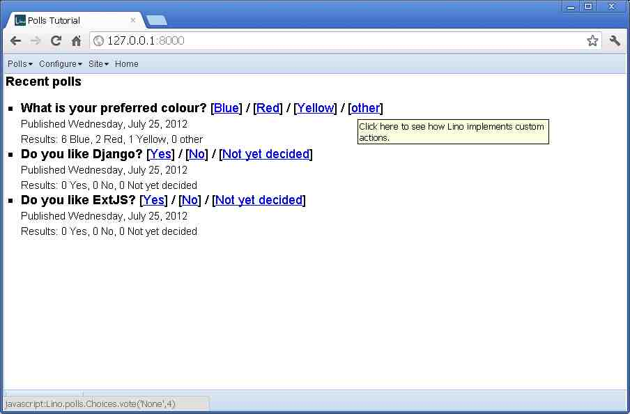
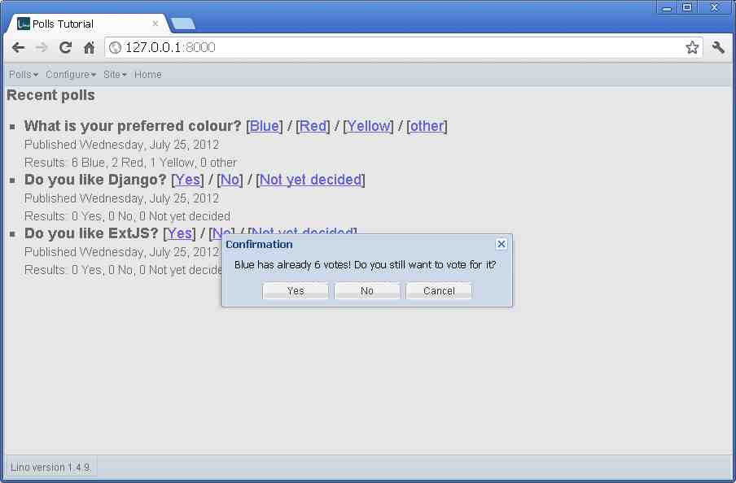
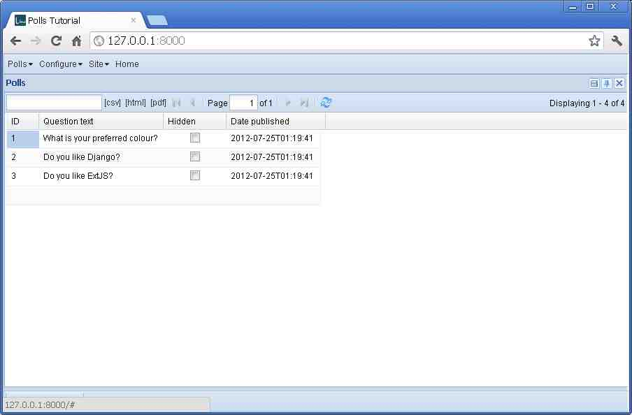
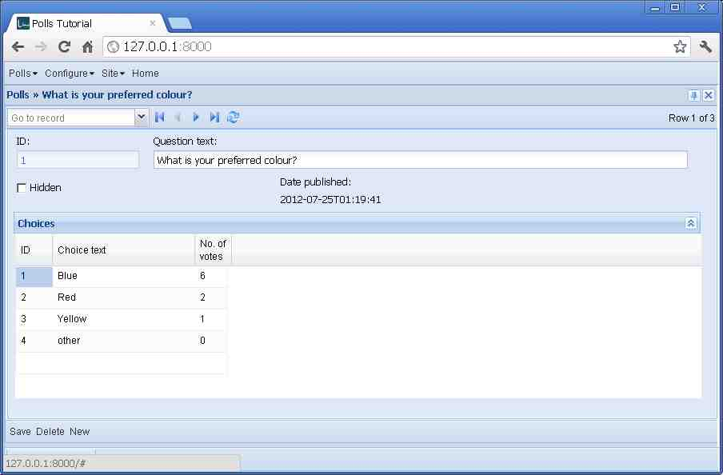
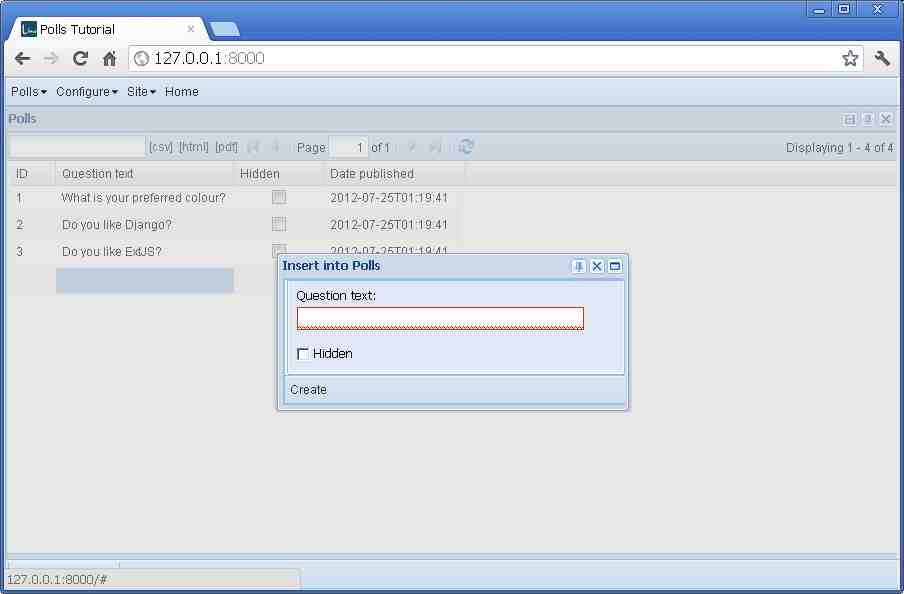
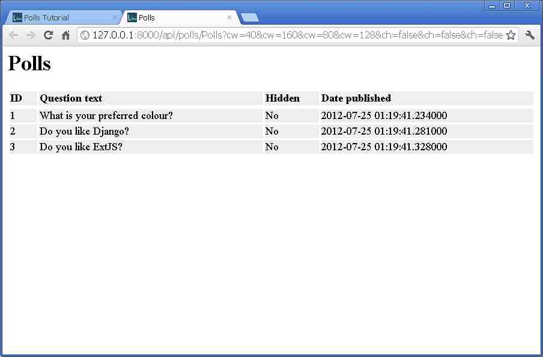
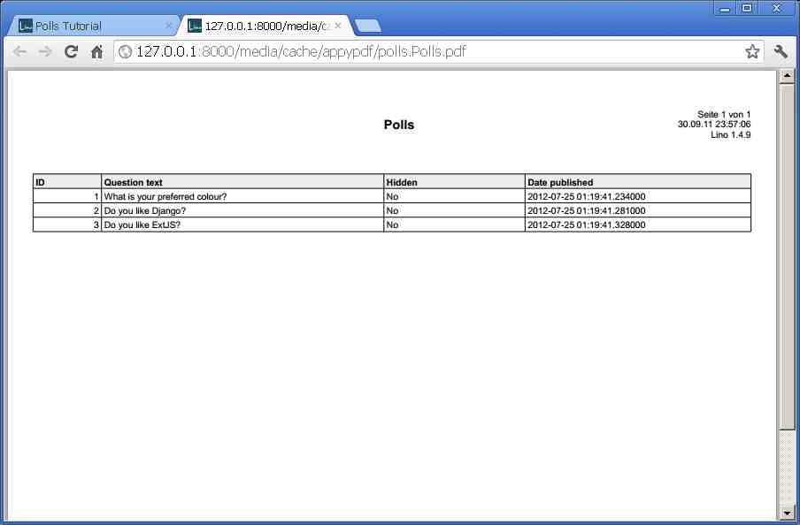

Your first standalone Lino application
======================================

In this tutorial you are going to write your first 
standalone Lino application.
Don't hesitate to send us your feedback 
if you have suggestions on how to make this tutorial better.

Note that this tutorial requires the development version 
of Lino (1.4.8 is not enough).
  
.. contents:: Table of Contents
 :local:
 :depth: 2

Create a local Django project
-----------------------------

Lino applications are Django projects.
That's why we recommend to start by reading
`Part 1 of the Django tutorial
<https://docs.djangoproject.com/en/1.4/intro/tutorial01/>`_,
which applies entirely for a Lino application.
The Django documentation is good,
and it introduces some important notions about
Creating a project,
The development server,
Database setup,
Creating models,
Activating models,
and Playing with the API.

Since you have already installed Lino and 
set up your Python Path as explained in 
:doc:`/admin/pythonpath`, we suggest that 
you take :file:`~/mypy/mysite` 
(or :file:`c:\\mypy\\mysite` if you are under Windows)
as your Django project directory and 
`mysite.settings`
for your :envvar:`DJANGO_SETTINGS_MODULE`
when following the Django tutorial.

- So please go now and follow
  `Part 1 of the Django tutorial
  <https://docs.djangoproject.com/en/1.4/intro/tutorial01/>`_.
  Afterwards we meet here again. See you later!

Done? Now we go further.

You have now a set of files in your "project directory". 
Your project is still lacking the most visible part:
a web interface.

The Django tutorial continues by introducing 
Django's Admin module to create a prototype web interface.
Although it is technically perfectly feasable to have both 
a Lino and an Admin interface, 
we now leave the Django philosophy 
and continue "the Lino way" of defining 
our application's web interface.
Lino is an alternative to Django's Admin module.

Most files remain unchanged, they are the same as with every Django project:
:xfile:`__init__.py`, :xfile:`manage.py`,
:xfile:`urls.py` and :xfile:`wsgi.py`.
You might want to compare your files with our version 
which you can see in the code repository at
:srcref:`/lino/tutorials/t1`.

But we are now going to modify the files 
:xfile:`settings.py` and
:xfile:`polls/models.py`.

The :xfile:`settings.py` file
-----------------------------

Lino uses some tricks to make Django :xfile:`settings.py`
files more pleasant to work with,
especially if you maintain Lino sites for several customers.

- Change the contents of your :xfile:`settings.py` 
  to the following (except for the :setting:`DATABASES` setting,
  which you should take over from your original file):

.. literalinclude:: ../../lino/tutorials/t1/settings.py

A few explanations:

Look at the following four lines of code which 
occur in almost every Lino :xfile:`settings.py` file 
and which are the thing that turns a Django project into 
a Lino application::

    from lino.apps.std.settings import *
    class Lino(Lino):
        ...
    LINO = Lino(__file__,globals()) 
    
- The first line caused your settings to "inherit" 
  from :mod:`lino.apps.std`, the common ancestor 
  of all Lino applications.

- The following lines (where the ``...`` part can be much more 
  than in our example) optionally override some of the class 
  attributes and methods defined for :class:`lino.Lino`. 
  For example the :attr:`lino.Lino.title` is a simple string to 
  occur in the browser's title bar (and possibly at other places).
  :meth:`setup_menu <lino.Lino.setup_menu>` 
  defines the structure of the main menu.
  And 
  :meth:`get_main_html <lino.Lino.get_main_html>` 
  returns the HTML to be displayed in the index page.

- The last line finally *instantiates* your local ``LINO``.
  Every Lino application requires a setting named ``LINO`` 
  which must be a :class:`lino.Lino` instance.
  It is available in your application code as ``settings.LINO``.
  
  The first argument of the instantiator is the built-in Python variable `__file__`.
  This is how Lino knows the full path of your local settings file.
  
  The second argument is the `global()` namespace of your settings module.
  Lino uses this to fill "intelligent default values" to your settings.
  That's why these lines should be at the *beginning* of your file.

One important setting to be defined by every Lino application 
is :setting:`INSTALLED_APPS`.

For this tutorial, we gave it the following value::

    INSTALLED_APPS = (
      'lino',
      'mysite.polls'
    )

Where you maybe need to change the last item to the name you used
during the Django Tutorial.

``lino`` is mandatory for every Lino application. 
It will cause the :mod:`lino.models` module to be loaded 
which defines some system tables and general application logic.
  

- To keep things simple in this first tutorial, we didn't use 
  the following modules which are almost mandatory for 
  any real application:

    - ``django.contrib.contenttypes``
      (though most of the other ``django.contrib.*`` modules are not 
      used in Lino)
    - ``lino.modlib.users``, is Lino's replacement for Django's ``django.contrib.auth``.

  
Some more Django settings deserve at least a comment:

- More documentation about the :setting:`LOGGING` 
  setting in :func:`lino.utils.log.configure`
  
- The :setting:`ROOT_URL` setting 
  and the files :file:`urls.py` and :file:`polls/views.py` 
  generated by Django
  are not necessary in our first Lino application. 
  With Lino you don't need to worry about URLs and views 
  because Lino defines them for you.

The :xfile:`models.py` file
---------------------------

- Change the contents of your :xfile:`polls/models.py` 
  to the following:

.. literalinclude:: ../../lino/tutorials/t1/polls/models.py

A few explanations while looking at that file:

- The :mod:`lino.dd` module is a shortcut to most Lino extensions 
  used by application programmers in their `models.py` modules. 
  `dd` stands for "data definition".
  
- :class:`dd.Model <lino.core.modeltools.Model>` 
  is a thin and optional wrapper around Django's Model class.
  For this tutorial you could use Django's `models.Model` as well,
  but we recommend to use `dd.Model` when there's no doubt that 
  you want Lino and not only Django.

- :class:`dd.Table <lino.core.table.Table>` is used as base class 
  for the three **Table** definitions in our application.
  That's an important new concept in Lino, and
  we'll talk about it in the Tables_ section.

- There's one **custom action** in our application, 
  defined as the `vote` method on the `Choice` model, 
  using the :class:`dd.action <lino.core.actions.action>` 
  decorator. Another important new concept in Lino, 
  we'll talk about it in the Actions_ section.
  
- The `recent_polls` function 
  (imported and called from your `settings.py` file)
  builds the HTML to be displayed in 
  our Main Window. It uses one Django-specific feature::

      Poll.objects.filter(hidden=False).order_by('pub_date')
      
  If you didn't know this, we recommend you to dive a bit 
  more into Django's documentation before seriously starting 
  your own Lino application. Lino is based on Django, and 
  Django is known for its good documentation. Use it!
  
  It also uses a Lino-specific feature, which admittedly 
  is less well documented: :meth:`row_action_button
  <lino.ui.extjs3.ext_ui.ExtUI.row_action_button>`
  return a HTML fragment that displays a button-like 
  link which will run the action when clicked.
  
But before explaining the details, let's have a look at the result.

Adding a demo fixture
---------------------

One more thing before seeing a result. 
We made at least one database change after the Django tutorial: 
we added the `hidden` field of a Poll.
So we must rebuild our database.
Because that's so easy, we'll also quickly add a demo fixture.

- If you haven't done it yet, please read now the 
  :doc:`dumpy` tutorial.
  
- Download the file   
  :srcref:`polls/fixtures/demo.py </lino/tutorials/t1/polls/fixtures/demo.py>`  
  from the Lino repository and add it 
  below your project directory.
  
- Create an empty file :srcref:`polls/fixtures/__init__.py </lino/tutorials/t1/polls/fixtures/__init__.py>` in that same directory.
  
- Run the following command (from your project directory) 
  to install these fixtures::

    python manange.py initdb demo
    
  The output should be similar to::
  
    INFO Analyzing models...
    We are going to flush your database (T:\hgwork\lino\lino\tutorials\t1\test.db).
    Are you sure (y/n) ?y
    INFO Lino initdb ('demo',) started on database T:\hgwork\lino\lino\tutorials\t1\test.db.
    INFO Using Lino 1.4.9, Django 1.5.dev17937, python-dateutil 1.5, Cheetah 2.4.4, 
    OdfPy ODFPY/0.9.4, docutils 0.7, suds 0.4.1, PyYaml 3.08, Appy 0.8.0 (2011/12/15 22:41), 
    Python 2.7.1.
    Creating tables ...
    Creating table lino_siteconfig
    Creating table polls_poll
    Creating table polls_choice
    Installing custom SQL ...
    Installing indexes ...
    Installed 0 object(s) from 0 fixture(s)
    INFO Saved 13 instances from T:\hgwork\lino\lino\tutorials\t1\polls\fixtures\demo.py.
    Installed 13 object(s) from 1 fixture(s)
    INFO Lino initdb done ('demo',) on database T:\hgwork\lino\lino\tutorials\t1\test.db.  
    
Now we are ready to start the development web server on our project.
  
Starting the web interface
--------------------------

Start the development server::

  $ cd ~/mypy/mysite
  $ python manage.py runserver
  
or (on Windows)::

  c:\mypy\mysite> python manage.py runserver
  
and point your browser to http://127.0.0.1:8000/ 
to see your first Lino application running.

- Please play around and create some polls before reading on.

Screenshots
-----------

Make sure that you understand and can reproduce 
the concepts explained in this section.

The **Main Window** is the top-level window of your application:

    
Your application specifies what to put there, and there are several 
methods to do this.
We used the :meth:`get_main_html <lino.Lino.get_main_html>` method 
which returns a chunk of generated html.
    
After clicking on a vote, here is the `vote` method 
of our `Choice` model in action:

    
    
After selecting :menuselection:`Polls --> Polls` in the main menu, 
Lino opens that table in a **Grid Window**:
    

    
Every table can be displayed in a **Grid Window**, a tabular 
representation with common functionality such as sorting, 
setting column filters, editing individual cells, 
and a context menu.
  
After double-clicking on a row in the previous screen, Lino shows 
the **Detail Window** on that Poll:

    
To add a Detail Window to a table, you simply add a 
:attr:`detail_layout 
<lino.core.actors.Actor.detail_layout>` attribute to the Table's 
class. The window above has been designed by the following code in 
your :file:`models.py` file::

    detail_layout = """
    id question 
    hidden pub_date
    ChoicesByPoll
    """

See :doc:`/topics/layouts` for more explanations.
   
    
Not all tables have a Detail Window. 
In our case the `Polls` table has one, 
but the `Choices` and `ChoicesByPoll` tables don't.
Double-clicking on a cell of a Poll will open the Detail Window,
but double-clicking on a cell of a Choice will start cell editing.
Note that can still edit an individual cell of a Poll in a Grid Window 
by pressing the :kbd:`F2` key.
  
    
After clicking the :guilabel:`New` button, you can admire 
an **Insert Window**:

    
This one exists because Polls has the following 
`insert_layout` attribute:: 

    insert_layout = dd.FormLayout("""
    question
    hidden
    """,window_size=(40,'auto'))
    
(Again: see :doc:`/topics/layouts` for more explanations).

After clicking the :guilabel:`[html]` button:

    
The :guilabel:`[pdf]` button works only if you have 
an OpenOffice or LibreOffice server running in 
background (don't worry about that for the moment).
    

Tables
------

A Table is the "abstract" definition of a tabular view.
It is not only used for the Grid Window but also to implement 
the :guilabel:`[html]` and :guilabel:`[pdf]` views.

A Table definition has attributes
like `filter` and `sort_order` 
which you know from Django's QuerySet.

But it also has Lino-specific attributes like 
:attr:`column_names <lino.utils.tables.AbstractTable.column_names>`,
:attr:`detail_layout <lino.core.actors.Actor.detail_layout>` 
or
:attr:`parameters <lino.core.actors.Actor.parameters>`.

To define Tables, you simply need to declare their classes.
Tables never get instantiated.
Lino discovers and analyzes them when it initializes.

Each Table class must have at least one class attribute 
`model` defined. This points to the Model on which this 
table will "work".

There are a lot of other options for tables, 
and they are documented in Lino's API doc for the
:class:`lino.core.table.Table` class.

Since tables are normal Python classes 
they can use inheritance.
In our code `ChoicesByPoll` inherits from `Choices` 
and not directly from `Table`.
that's why we don't need to explicitly specify that 

`ChoicesByPoll` is an example of a :term:`slave table`.
`ChoicesByPoll` means: the table of `Choices` 
of a given `Poll`. That given Poll is called the "master" 
of these choices.
A slave table is a table who depends on a master.

A table is a slave table when it has a class attribute 
:attr:`master_key <lino.core.table.Table.master_key>`.
This is a string containing 
the name of a ForeignKey field which 
must exist in the Table's model.

Note that you can define more than one Table per Model.
This is a fundamental difference from Django's concept of 
the `ModelAdmin` class and `Model._meta` options.

Actions
-------

Lino has a class :class:`Action <lino.core.actions.Action>` 
which represents the methods who have a clickable button 
or menu item in the user interface. 
Each :class:`Action <lino.core.actions.Action>`
instance holds a few important pieces of information:

- label : the text to place on the button or menu item
- help_text : the text to appear as tooltip when the mouse is over that button
- permission requirements : specify who and under which conditions this action is available (a complex subject, we'll talk about it in a later tutorial)
- handler function : the function to execute when the action is invoked

Many actions are managed automatically by Lino. For example:

- each table has a "default action" which is 
  to open a window which displays this table as a grid.
  That's why (in the :meth:`setup_menu <lino.Lino.setup_menu>`
  method of your :xfile:`settings.py`) you can say::

    m.add_action(self.modules.polls.Polls)

  The :meth:`add_action <lino.core.menus.Menu.add_action>` method of Lino's 
  :class:`lino.core.menus.Menu` is smart enough to understand that if you 
  specify a Table, you mean in fact that table's default action.

- The :guilabel:`Save`, :guilabel:`Delete` and :guilabel:`New` 
  buttons in the bottom toolbar of the Detail window have their own 
  :class:`Action <lino.core.actions.Action>` instance.
  
One way to define custom actions is to decorate a model method with the
:func:`dd.action <lino.core.actions.action>` decorator.
The decorator itself can have keyword parameters to specify 
information about the action. In practice these may be 
:attr:`label <lino.core.actions.Action.label>`,
:attr:`help_text <lino.core.actions.Action.help_text>` and
:attr:`required <lino.core.actions.Action.required>`.

The action itself (i.e. the method) should have the following signature::

    def vote(self,ar,**kw):
        ...
        return kw
        
Where `ar` is an :class:`ActionRequest <lino.core.actions.ActionRequest>` 
instance that holds information about the web request and provides methods 
like

- :class:`success_response <lino.core.actions.ActionRequest.success_response>`
- :class:`error_response <lino.core.actions.ActionRequest.error_response>`
- :class:`confirm <lino.core.actions.ActionRequest.confirm>`
- :class:`spawn <lino.core.actions.ActionRequest.spawn>`

Summary
-------

In this tutorial we followed Part 1 of the Django Tutorial, 
then continued the Lino way and explained two important new Lino concepts: 
Tables and Actions

