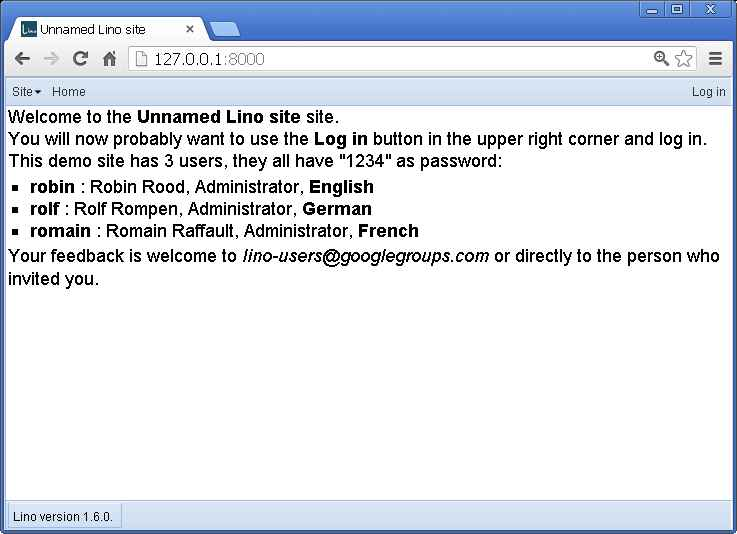

Getting started
===============

This document is the first unit of a planned series of tutorial-style 
lessons for *Lino application developers*.
The shell examples in this document were made on a Windows machine 
but should work the same on every platform.

**This document is work in progress.**
The examples are likely to not work exactly as described when you try them.
But that's part of the game and you are going to learn from each problem.
Please report any problems (and joys and questions) you experienced 
during this fist lesson.

Note that Lino doesn't yet run under Python3, you need Python 2.7 or 2.6.  
  
If your computer has Python and pip installed, then just type::

  C:\temp> pip install lino
  
If you want to install the newest pre-release versions, type::
  
  C:\temp> pip install -U -f http://lino.saffre-rumma.net/dl lino
  
or even::

  C:\temp> pip install -U --force-reinstall -f http://lino.saffre-rumma.net/dl lino
  
or even::

  C:\temp> pip install -U --noindex --force-reinstall -f http://lino.saffre-rumma.net/dl lino
 
For other situations and methods of installing Lino, see :doc:`/admin/index`.

We begin by creating a Django project::

  C:\temp> django-admin startproject mysite
  
In case the above command is new to you, 
we recommend to read
`Part 1 of the Django tutorial
<https://docs.djangoproject.com/en/1.4/intro/tutorial01/>`_,
which applies entirely for a Lino project.
The Django documentation is good,
and it introduces some important notions about
Creating a project,
The development server,
Database setup,
Creating models,
Activating models,
and Playing with the API.

Now take the :xfile:`settings.py` file of your project 
and replace the whole content of this file 
with the following two lines::

  from lino.projects.cosi.settings import *
  SITE = Site(__file__,globals())

That is, we import settings from Lino Così, 
one of the out-of-the-box projects included with Lino.
Then we create a :setting:`SITE` setting which for the moment 
is just an instance of an unmodified :class:`lino.Site` setting object.
This second line occurs in this same form in every 
Lino :xfile:`settings.py` file.

Next we create a database with some content.
This is just one command to type::

  C:\temp\mysite> python manage.py initdb_demo

Lino will ask you::

  INFO Started manage.py initdb_demo (using mysite.settings) --> PID 3848
  INFO This is Lino Così 0.1 using Python 2.7.3, Django 1.4.5, django-site 0.0.2, North 0.0.2, Lino 1.6.0, Jinja 2.6, Sphinx 1.1.3, python-dat
  eutil 2.1, OdfPy ODFPY/0.9.6, docutils 0.10, suds 0.4, PyYaml 3.10, Appy 0.8.3 (2013/02/22 15:29).
  INFO Languages: en, de, fr. 16 apps, 37 models, 93 actors.
  We are going to flush your database (C:\temp\mysite\mysite\default.db).
  Are you sure (y/n) ?

If you answer "y" here, 
Lino will delete everything in the given database file
and replace it with its "factory default" demo data.
That's what we want, so go on and type ``y``::

  Creating tables ...
  Creating table ui_siteconfig
  ...
  Installing custom SQL ...
  Installing indexes ...
  INFO Loading t:\hgwork\lino\lino\ui\fixtures\std.py...
  ...
  INFO Loading t:\hgwork\lino\lino\projects\cosi\fixtures\userman.py...
  Installed 361 object(s) from 14 fixture(s)
  INFO Stopped manage.py initdb_demo (PID 3780)  

Now we can start the development server::

  C:\temp> python manage.py runserver
  
which should output something like::  
  
  Validating models...
  0 errors found
  Django version 1.4.5, using settings 'mysite.settings'
  Development server is running at http://127.0.0.1:8000/
  Quit the server with CTRL-BREAK.

And then point our web browser to http://127.0.0.1:8000/.
This produces the same result as 
the `online demo of Lino Così 
<http://demo4.lino-framework.org/>`__.

Congratulations for having installed your first Lino application.

Note what the development server does when the first web request arrives::

  INFO Checking /media URLs
  INFO Building C:\temp\mysite\mysite\media\cache\js\lino_000_de.js ...
  [27/Feb/2013 10:42:36] "GET / HTTP/1.1" 200 4465
  [27/Feb/2013 10:42:40] "GET /media/cache/js/lino_000_de.js HTTP/1.1" 200 198655

