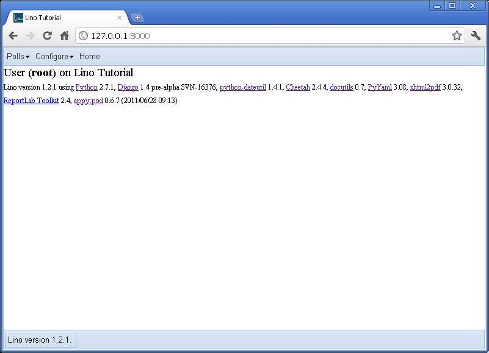
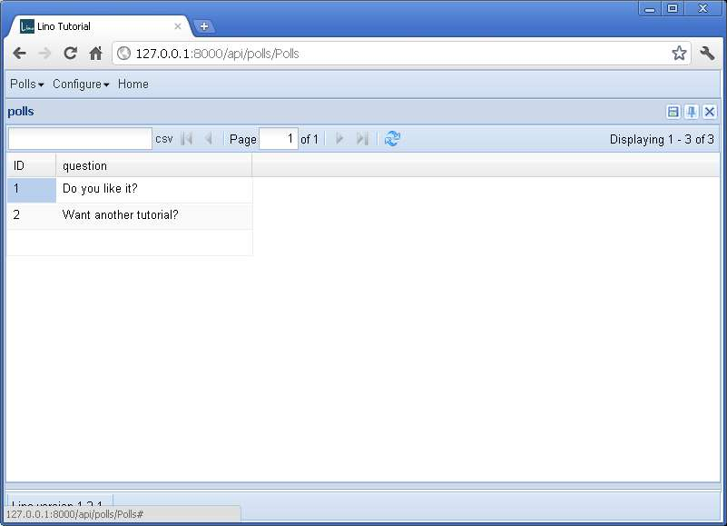
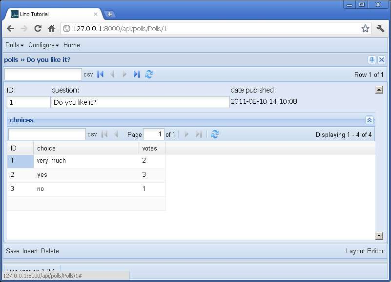

Your first standalone Lino application
======================================

(Work in progress. 
Please don't blame me if the documentation grows less quickly than Lino...)

In this tutorial you are going to write your first 
standalone Lino application.
Don't hesitate to send us your feedback 
if you have suggestions on how to make this tutorial better.
  
.. contents:: Table of Contents
 :local:
 :depth: 2

Create a local Django project
-----------------------------

Lino applications are Django projects.
In case you don't know Django, you should 
now follow
`Part 1 of the Django tutorial
<https://docs.djangoproject.com/en/1.3/intro/tutorial01/>`_
which applies entirely for a Lino application.
The Django documentation is good,
and it introduces some important notions about
Creating a project,
The development server,
Database setup,
Creating models,
Activating models,
and Playing with the API.

Choose `c:\\mypy\\mysite` 
for your Django project directory and `mysite.settings`
for your `DJANGO_SETTINGS_MODULE`.

When you've done and learned all this, we go further.

Replace the :xfile:`settings.py` 
of your project directory 
with the following:

.. literalinclude:: ../../lino/tutorials/t1/settings.py

    

More about the `settings.py` file
---------------------------------

Let's take your :xfile:`settings.py` file again and 
make some more changes to it.

Lino uses some tricks to make Django settings 
files more pleasant to work with,
especially if you maintain Lino sites for several customers.

At the beginning of the file are the following four lines of code::

    from lino.apps.pcsw.settings import *
    class Lino(Lino):
        title = "Lino Tutorial"
    LINO = Lino(__file__,globals()) 
    
The first line caused your settings to "inherit" 
from one of the predefined Lino applications.
Since this is going to be your own application, 
replace the ``pcsw`` or ``igen`` by ``std``::

    from lino.apps.std.settings import *
    
Because we no longer inherit settings 
from one of the predefined Lino applications, 
we now need to define the :setting:`INSTALLED_APPS` 
setting.
For this tutorial, put the following value::

    INSTALLED_APPS = (
      'django.contrib.contenttypes',
      'lino.modlib.users',
      'lino',
      'mysite.polls'
    )

Where you maybe need to change the last item to the name you used
during the Django Tutorial.

  
A few comments: 
  
- Most of the ``django.contrib.*`` modules are not 
  used in Lino, one exception is 
  ``django.contrib.contenttypes``.
- The ``lino.modlib.users`` is Lino's replacement 
  for Django's ``django.contrib.auth``.
- ``lino`` is mandatory for every Lino application.
  
Some more settings deserve our attention at this moment:

- Lino requires a setting named ``LINO`` which must 
  be a :class:`lino.Lino` instance.
  The first argument of the instantiator for the Lino class
  is the built-in Python variable `__file__`.
  This way you tell Lino the full path of your local settings file.
  The second argument is the `global()` namespace of your settings module.
  Lino will use this to fill "intelligent default values" to your settings.
  That's why these lines should be at the *beginning* of your file.

- More documentation about the :setting:`LOGGING` 
  setting in :func:`lino.utils.log.configure`
  
- The :setting:`ROOT_URL` setting 
  and the files :file:`urls.py` and :file:`polls/views.py` 
  generated by Django
  are not necessary in our first Lino application. 
  With Lino you don't need to worry about URLs and views 
  because Lino defines them for you.

You might want to compare your files with our version 
which you can see in the code repository at
:srcref:`/lino/tutorials/t1`.

 
Designing the user interface
----------------------------

While the Django tutorial now continues by introducing Django's Admin module, 
we leave them alone and continue "the Lino way" of defining 
our application's user interface.
Remember that Lino is an alternative to Django's Admin module.

First we will add three :term:`Tables`.
A Table is the definition of a tabular view, 
usually displayed in a Grid.
A Table definition has 
attributes
like `filter` and `sort_order` 
which will be forwarded to the QuerySet 
and which we sometimes call "row parameters" 
because they influence the rows to be selected.
But it also has configurable attributes like 
`column_names` or `detail_template` 
who go beyond the concept of a QuerySet.
You'll soon learn more about them.

To define Tables, you simply need to declare their classes.
Tables never get instantiated.
Lino discovers and analyzes them when it initializes.

Add the following code to the end your :file:`polls/models.py`::

  from lino import dd

  class Polls(dd.Table):
      "Displays the list of all Polls."
      model = Poll
      
  class Choices(dd.Table):
      "Displays a list of all Choices."
      
      model = Choice
      
      detail_template = """
        id question pub_date
        polls.ChoicesByPoll
        """
          
  class ChoicesByPoll(Choices):
      "Displays the Choices for a given Poll."
      master_key = 'poll'
      

Each Table class must have at least one class attribute 
`model` defined. This points to the Model on which this 
table will "work".

There are a lot of other options for tables, 
and they are documented in Lino's API doc for the
:class:`lino.core.table.Table` class.

Since tables are normal Python classes 
they can use inheritance.
In our code `ChoicesByPoll` inherits from `Choices` 
and not directly from `Table`.
that's why we don't need to explicitly specify that 

Note also that `ChoicesByPoll` is a :term:`slave table`
because it has a class attribute 
:attr:`master_key <lino.core.table.Table.master_key>`.
This is a string containing 
the name of a ForeignKey field which must exist in the Table's 
model.
`ChoicesByPoll` is a table of `Choice` instances
having a `Poll` instance as master. 
A slave table is a table who depends on a master.
needs to know on which master it is to execute.

Note that you can define more than one Table per Model.
This is a fundamental difference from Django's concept of 
the `ModelAdmin` class and `Model._meta` options.

While you are in :file:`polls/models.py` you should also 
add a `auto_now_add=True` option to the pub_date field::
      
    pub_date = models.DateTimeField('date published',auto_now_add=True)
    
Without this change you would later get problems when trying
to create a Poll: DateTimeFields are always read-only (Lino won't 
let you edit it), but the database will complain that the field may 
not be NULL. Django's `auto_now_add` option is one possible solution 
to this.

Compare your :file:`models.py` to our model at
:srcref:`/lino/tutorials/t1/polls/models.py`.

Then add a `setup_menu` method to the `Lino` class 
defined in your :file:`settings.py`::

    class Lino(Lino):
        title = "Lino Tutorial"
        
        def setup_menu(self,ui,user,main):
            m = main.add_menu("polls","~Polls")
            m.add_action(self.modules.polls.Polls)
            
            m = main.add_menu("config","~Configure")
            m.add_action(self.modules.users.Users)
        
        
Compare your :xfile:`settings.py` to our model at
:srcref:`/lino/tutorials/t1/settings.py`.

That's all! Now start the development server::

  $ cd /home/luc/mysite
  $ python manage.py runserver
  
or (on Windows)::

  c:\mypy\mysite> python manage.py runserver
  
and point your browser to http://127.0.0.1:8000/ 
to see your first Lino application running.

A rather decent functionality, but it works: 
you have a main menu, and you can enter poll questions.

Please play around and create some polls. 

    
Defining your first data entry form
-----------------------------------

You'll have noticed that there is currently 
no way to enter Choices for a poll.
We are going to fix that quickly!
Add the following attribute to the declaration of your 
`Choices` table::

    detail_template = """
      id question pub_date
      ChoicesByPoll
      """

Then restart the server and double-click on one of the polls 
you previously created. Or double-click on the last 
empty "phantom line" to create a new Poll.

That's all for this first tutorial.
I hope you enjoyed it.
Are there any questions?

You might want to compare your files with our version 
of this step of the tutorial:
See :srcref:`/lino/tutorials/t1b`.
